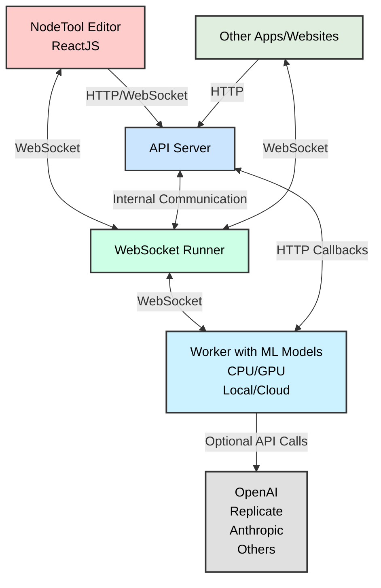

# Nodetool Core

Nodetool Core is the core library for Nodetool, providing the necessary functionality for building and running AI workflows.

## Features

- Node-based workflow system for AI applications
- Support for various AI providers (OpenAI, Anthropic, etc.)
- Storage and persistence mechanisms
- Workflow execution engine
- Type system for workflow nodes

## Using NodeTool Programmatically

While NodeTool offers a powerful visual interface through its main application, you can also use NodeTool Core directly in your Python code to create and run workflows programmatically. This approach gives you the flexibility to integrate NodeTool's capabilities into your existing applications or scripts.

### Creating and Running Workflows in Python

NodeTool uses a declarative, node-based approach to define workflows. Each node represents a specific operation, and nodes are connected to form a graph that represents the workflow.

Here are examples of how to use NodeTool programmatically for different use cases:

#### Example 1: Email Summarization

This example demonstrates how to create a workflow that retrieves recent emails from Gmail, formats them, and generates a summary using the Llama model via Ollama:

```python
import asyncio
from nodetool.dsl.google.mail import GmailSearch, EmailFlag
from nodetool.dsl.graph import graph, run_graph
from nodetool.dsl.nodetool.output import StringOutput
from nodetool.dsl.nodetool.text import Join, Concat
from nodetool.dsl.ollama.text import Ollama
from nodetool.dsl.nodetool.list import MapTemplate
from nodetool.metadata.types import LlamaModel

# Search Gmail for recent emails
emails = GmailSearch(
    date_filter=GmailSearch.DateFilter.SINCE_ONE_DAY,
    max_results=2,
)

# Format emails into a template
formatted_emails = MapTemplate(
    values=emails,
    template="==================\nFrom: {sender}\nSubject: {subject}\nBody: {body}\n==================",
)

# Join all formatted emails
joined_emails = Join(strings=formatted_emails, separator="")

# Add summarization prompt
prompt = Concat(
    a=joined_emails,
    b="Create a concise and well-structured summary of the emails above. Prioritize important topics at the top, group related emails together, and include a separate section for newsletters. Summarize each email briefly, highlighting key details, and organize the digest for easy scanning and action.",
)

# Generate summary using Llama
summary = Ollama(
    prompt=prompt,
    model=LlamaModel(repo_id="llama3.2:3b"),
    system_prompt="You are a summarizer.",
    context_window=65536,
    temperature=0,
    top_k=50,
    top_p=0.95,
)

output = StringOutput(
    name="summary",
    description="Summary of the emails",
    value=summary,
)

# Run the workflow and print the result
summary_str = asyncio.run(run_graph(graph(output)))
print(summary_str)
```

#### Example 2: PDF Indexing for RAG Applications

This example shows how to create a workflow that loads a PDF document, extracts text, splits it into sentences, and indexes the chunks in a ChromaDB vector database for later retrieval:

```python
import asyncio
import os
from nodetool.dsl.graph import graph, run_graph
from nodetool.dsl.chroma.collections import Collection
from nodetool.dsl.chroma.index import IndexTextChunks
from nodetool.dsl.lib.data.langchain import SentenceSplitter
from nodetool.dsl.lib.file.pymupdf import ExtractText
from nodetool.dsl.nodetool.os import LoadDocumentFile
from nodetool.metadata.types import FilePath, LlamaModel

# Set up paths
dirname = os.path.dirname(__file__)
file_path = os.path.join(dirname, "deepseek_r1.pdf")

# Create indexing workflow
g = IndexTextChunks(
    collection=Collection(name="papers"),
    text_chunks=SentenceSplitter(
        text=ExtractText(
            pdf=LoadDocumentFile(path=FilePath(path=file_path)),
        ),
        document_id=file_path,
    ),
)

# Run the workflow
asyncio.run(run_graph(graph(g)))
```

#### Example 3: Machine Learning with scikit-learn

This example demonstrates how to create a machine learning workflow that loads the Iris dataset, splits it into training and testing sets, scales the features, trains a Random Forest classifier, makes predictions, and calculates accuracy:

```python
import asyncio
from nodetool.dsl.graph import graph, run_graph
from nodetool.dsl.lib.ml.sklearn import PredictNode
from nodetool.dsl.lib.ml.sklearn.datasets import LoadIrisDataset
from nodetool.dsl.lib.ml.sklearn.metrics import AccuracyNode
from nodetool.dsl.lib.ml.sklearn.preprocessing import (
    StandardScalerNode,
    TransformNode,
)
from nodetool.dsl.lib.ml.sklearn.model_selection import TrainTestSplitNode
from nodetool.dsl.lib.ml.sklearn.ensemble import RandomForestClassifierNode
from nodetool.nodes.lib.ml.sklearn.ensemble import RandomForestCriterion

# Create dataset
dataset = LoadIrisDataset()

# Split data
split = TrainTestSplitNode(
    X=(dataset, "data"),
    y=(dataset, "target"),
    test_size=0.25,
    shuffle=True,
)

# Scale features
scaler = StandardScalerNode(
    X=(split, "X_train"),
    with_mean=True,
    with_std=True,
)

# Transform test data
transform = TransformNode(
    X=(split, "X_test"),
    model=(scaler, "model"),
)

# Train classifier
clf = RandomForestClassifierNode(
    X_train=(scaler, "transformed"),
    y_train=(split, "y_train"),
    n_estimators=100,
    criterion=RandomForestCriterion.ENTROPY,
    random_state=32,
)

# Make predictions
predictions = PredictNode(
    X=(transform, "transformed"),
    model=(clf, "model"),
)

# Calculate accuracy
accuracy = AccuracyNode(
    y_true=(split, "y_test"),
    y_pred=(predictions, "output"),
)

# Run the workflow
g = graph(accuracy)
asyncio.run(run_graph(g))
```

### Key Concepts

When using NodeTool programmatically, keep these key concepts in mind:

1. **Nodes**: Each node represents a specific operation or function. Nodes have inputs and outputs that can be connected to form a workflow.

2. **Graph**: A collection of nodes and their connections, representing the entire workflow.

3. **DSL (Domain-Specific Language)**: NodeTool provides a Python DSL for creating workflows, with specialized modules for different domains (e.g., `nodetool.dsl.google.mail`, `nodetool.dsl.chroma.collections`).

4. **Execution**: Workflows are executed using the `run_graph` function, which takes a graph object created with the `graph` function.

## Workflow Execution Architecture

NodeTool Core includes a sophisticated workflow execution engine that processes directed graphs of computational nodes. Understanding how workflows are executed can help you build more efficient and effective workflows.

### WorkflowRunner

The `WorkflowRunner` class is the heart of NodeTool's execution engine. It handles:

- Parallel execution of independent nodes
- GPU resource management with ordered locking
- Result caching for cacheable nodes
- Error handling and retry logic for GPU OOM situations
- Progress tracking and status updates
- Support for both regular nodes and group nodes (subgraphs)

### Execution Process

When you run a workflow, the following steps occur:

1. **Initialization**: The runner is initialized with a job ID and automatically detects the available device (CPU, CUDA, or MPS).

2. **Graph Loading**: The workflow graph is loaded from the request, and nodes are instantiated.

3. **Input Processing**: Input parameters are assigned to the corresponding input nodes.

4. **Graph Validation**: The graph is validated to ensure all edges are valid and all required inputs are provided.

5. **Node Initialization**: All nodes in the graph are initialized.

6. **Graph Processing**:

   - Nodes without incoming edges are processed first
   - As nodes complete, messages are sent to downstream nodes
   - Nodes are processed when all their required inputs are available
   - GPU-intensive nodes acquire a lock before execution to manage resources

7. **Result Collection**: Results from output nodes are collected and returned.

8. **Finalization**: Resources are cleaned up, and the final status is reported.

### Advanced Features

- **Parallel Execution**: Independent nodes are executed in parallel using asyncio.
- **GPU Management**: The runner intelligently manages GPU resources, with retry logic for out-of-memory situations.
- **Subgraph Support**: Group nodes can contain entire subgraphs, enabling hierarchical workflows.
- **Progress Tracking**: The runner provides real-time progress updates during execution.

### Code Example: Creating a Custom WorkflowRunner

For advanced use cases, you can create and use a WorkflowRunner directly:

```python
from nodetool.workflows.workflow_runner import WorkflowRunner
from nodetool.workflows.run_job_request import RunJobRequest
from nodetool.workflows.processing_context import ProcessingContext

# Create a runner with a unique job ID
runner = WorkflowRunner(job_id="my-custom-job-123")

# Create a request with your graph and parameters
request = RunJobRequest(graph=my_graph, params=my_params)

# Create a processing context
context = ProcessingContext()

# Run the workflow
await runner.run(request, context)

# Access results from the context
results = context.get_results()
```

## Architecture 🏗️

NodeTool's architecture is designed to be flexible and extensible.



### Components Overview

1. **🖥️ Frontend**: The NodeTool Editor for managing workflows and assets, built with ReactJS and TypeScript.
2. **🌐 API Server**: Manages connections from the frontend and handles user sessions and workflow storage.
3. **🔌 WebSocket Runner**: Runs workflows in real-time and keeps track of their state.

## Using the Workflow API 🔌

NodeTool provides a powerful Workflow API that allows you to integrate and run your AI workflows programmatically.

You can use the API locally now, `api.nodetool.ai` access is limited to Alpha users.

### API Usage

#### Loading Workflows

```javascript
const response = await fetch("http://localhost:8000/api/workflows/");
const workflows = await response.json();
```

#### Running a Workflow

##### HTTP API

```bash
curl -X POST "http://localhost:8000/api/workflows/<workflow_id>/run" \
-H "Content-Type: application/json" \
-d '{
    "params": {
        "param_name": "param_value"
    }
}'
```

```javascript
const response = await fetch(
  "http://localhost:8000/api/workflows/<workflow_id>/run",
  {
    method: "POST",
    headers: {
      "Content-Type": "application/json",
    },
    body: JSON.stringify({
      params: params,
    }),
  }
);

const outputs = await response.json();
// outputs is an object with one property for each output node in the workflow
// the value is the output of the node, which can be a string, image, audio, etc.
```

#### Streaming API

The streaming API is useful for getting real-time updates on the status of the workflow.

See [run_workflow_streaming.js](examples/run_workflow_streaming.js) for an example.

These updates include:

- job_update: The overall status of the job (e.g. running, completed, failed, cancelled)
- node_update: The status of a specific node (e.g. running, completed, error)
- node_progress: The progress of a specific node (e.g. 20% complete)

The final result of the workflow is also streamed as a single job_update with the status "completed".

```javascript
const response = await fetch(
  "http://localhost:8000/api/workflows/<workflow_id>/run?stream=true",
  {
    method: "POST",
    headers: {
      "Content-Type": "application/json",
    },
    body: JSON.stringify({
      params: params,
    }),
  }
);

const reader = response.body.getReader();
const decoder = new TextDecoder();

while (true) {
  const { done, value } = await reader.read();
  if (done) break;

  const lines = decoder.decode(value).split("\n");
  for (const line of lines) {
    if (line.trim() === "") continue;

    const message = JSON.parse(line);
    switch (message.type) {
      case "job_update":
        console.log("Job status:", message.status);
        if (message.status === "completed") {
          console.log("Workflow completed:", message.result);
        }
        break;
      case "node_progress":
        console.log(
          "Node progress:",
          message.node_name,
          (message.progress / message.total) * 100
        );
        break;
      case "node_update":
        console.log(
          "Node update:",
          message.node_name,
          message.status,
          message.error
        );
        break;
    }
  }
}
```

##### WebSocket API

The WebSocket API is useful for getting real-time updates on the status of the workflow.
It is similar to the streaming API, but it uses a more efficient binary encoding.
It offers additional features like canceling jobs.

See [run_workflow_websocket.js](examples/run_workflow_websocket.js) for an example.

```javascript
const socket = new WebSocket("ws://localhost:8000/predict");

const request = {
  type: "run_job_request",
  workflow_id: "YOUR_WORKFLOW_ID",
  params: {
    /* workflow parameters */
  },
};

// Run a workflow
socket.send(
  msgpack.encode({
    command: "run_job",
    data: request,
  })
);

// Handle messages from the server
socket.onmessage = async (event) => {
  const data = msgpack.decode(new Uint8Array(await event.data.arrayBuffer()));
  if (data.type === "job_update" && data.status === "completed") {
    console.log("Workflow completed:", data.result);
  } else if (data.type === "node_update") {
    console.log("Node update:", data.node_name, data.status, data.error);
  } else if (data.type === "node_progress") {
    console.log("Progress:", (data.progress / data.total) * 100);
  }
  // Handle other message types as needed
};

// Cancel a running job
socket.send(msgpack.encode({ command: "cancel_job" }));

// Get the status of the job
socket.send(msgpack.encode({ command: "get_status" }));
```

### API Demo

- Download the [html file](<(api-demo.html)>)
- Open in a browser locally.
- Select the endpoint, local or api.nodetool.ai (for alpha users)
- Enter API token (from Nodetool settings dialog)
- Select workflow
- Run workflow
- The page will live stream the output from the local or remote API

## Installation

```bash
# Install using Poetry
poetry install
```

## Development

### Setup

1. Clone the repository
2. Install dependencies with Poetry:
   ```bash
   poetry install
   ```

### Testing

Run tests with pytest:

```bash
poetry run pytest
```

### Code Style

This project uses Black for code formatting:

```bash
poetry run black .
```

## License

[AGPL License](LICENSE)
