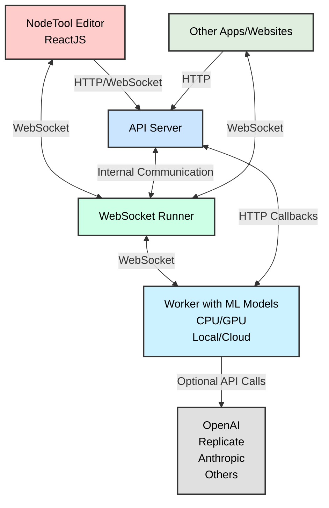

# NodeTool Core 

<p align="center">
  
  
  
  
  
</p>

<p align="center">
  <b>Agentic Workflows/b>
</p>

## 📚 Overview

NodeTool Core is the Python library behind [NodeTool App](https://github.com/nodetool-ai/nodetool) for building and running agentic workflows using a modular, node-based approach.

### ✨ Key Features

- 🔄 **Node-based workflow system** - Compose complex workflows from simple building blocks
- 🧠 **Advanced agent system** - Create intelligent agents with specialized capabilities
- 🤖 **Multi-provider AI support** - Seamless integration with OpenAI, Anthropic, Ollama, and more
- 🧩 **Modular architecture** - Easily extend with custom nodes and functionality
- ⚡ **Workflow execution engine** - Run workflows efficiently on CPU or GPU
- 📊 **RAG Support** -- Integrates with Chroma for vector storage

## 🚀 Quick Start

### Installation

```bash
# Install using pip
pip install nodetool-core

# Or with Poetry
poetry add nodetool-core
```

### Basic Usage

```python
import asyncio
from nodetool.dsl.graph import graph, run_graph
from nodetool.dsl.providers.openai import ChatCompletion
from nodetool.metadata.types import OpenAIModel

# Create a simple workflow
g = ChatCompletion(
    model=OpenAIModel(model="gpt-4"),
    messages=[{"role": "user", "content": "Explain quantum computing in simple terms"}]
)

# Run the workflow
result = asyncio.run(run_graph(graph(g)))
print(result)
```

## 📖 Documentation

- [Concepts and Architecture](https://docs.nodetool.ai/concepts/)
- [Getting Started Guide](https://docs.nodetool.ai/getting-started/)
- [API Reference](https://docs.nodetool.ai/api-reference/)
- [Examples](https://docs.nodetool.ai/examples/)
- [Advanced Usage](https://docs.nodetool.ai/advanced/)

## 🧩 Examples

```python
    context = ProcessingContext()

    provider = get_provider(Provider.OpenAI)
    model = "gpt-4o"

    retrieval_tools = [
        GoogleSearchTool(context.workspace_dir),
        BrowserTool(context.workspace_dir),
    ]

    agent = Agent(
        name="Research Agent",
        objective="""
        Research the competitive landscape of AI code assistant tools.
        1. Use google search and browser to identify a list of AI code assistant tools
        2. For each tool, identify the following information:
            - Name of the tool
            - Description of the tool
            - Key features of the tool
            - Pricing information
            - User reviews
            - Comparison with other tools
        3. Summarize the findings in a table format
        """,
        provider=provider,
        model=model,
        tools=retrieval_tools,
        output_schema={
            "type": "object",
            "properties": {
                "tools": {
                    "type": "array",
                    "items": {
                        "type": "object",
                        "properties": {
                            "name": {"type": "string"},
                            "description": {"type": "string"},
                            "key_features": {"type": "string"},
                            "pricing": {"type": "string"},
                            "user_reviews": {"type": "string"},
                            "comparison_with_other_tools": {"type": "string"},
                        },
                    },
                },
            },
        },
    )
    async for item in agent.execute(context):
        if isinstance(item, Chunk):
            print(item.content, end="", flush=True)

    print(f"\nWorkspace: {context.workspace_dir}")
    print(f"Results: {agent.results}")

```

More examples can be found in the [examples](./examples) directory.

## 🏗️ Architecture

NodeTool's architecture is designed to be flexible and extensible.



## 🤝 Contributing

We welcome contributions from the community! Please see our [Contributing Guidelines](./CONTRIBUTING.md) for more information on how to get involved.

### Development Setup

This setup is for developing the `nodetool-core` library itself using Poetry. If you want to set up the full NodeTool application (UI, backend, etc.), please refer to the development setup instructions in the main [NodeTool repository](https://github.com/nodetool-ai/nodetool).

1. Clone the repository

   ```bash
   git clone https://github.com/yourusername/nodetool-core.git
   cd nodetool-core
   ```

2. Install dependencies with Poetry

   ```bash
   poetry install
   ```

3. Install pre-commit hooks

   ```bash
   pre-commit install
   ```

4. Run tests
   ```bash
   poetry run pytest
   ```

## 📄 License

[AGPL License](./LICENSE)

## 📚 Learn More

- [NodeTool Website](https://nodetool.ai)
- [Discord Community](https://discord.gg/nodetool)

#### Example 2: PDF Indexing for RAG Applications

This example shows how to create a workflow that loads a PDF document, extracts text, splits it into sentences, and indexes the chunks in a ChromaDB vector database for later retrieval:

```python
import asyncio
import os
from nodetool.dsl.graph import graph, run_graph
from nodetool.dsl.chroma.collections import Collection
from nodetool.dsl.chroma.index import IndexTextChunks
from nodetool.dsl.lib.data.langchain import SentenceSplitter
from nodetool.dsl.lib.file.pymupdf import ExtractText
from nodetool.dsl.nodetool.os import LoadDocumentFile
from nodetool.metadata.types import FilePath, LlamaModel

# Set up paths
dirname = os.path.dirname(__file__)
file_path = os.path.join(dirname, "deepseek_r1.pdf")

# Create indexing workflow
g = IndexTextChunks(
    collection=Collection(name="papers"),
    text_chunks=SentenceSplitter(
        text=ExtractText(
            pdf=LoadDocumentFile(path=FilePath(path=file_path)),
        ),
        document_id=file_path,
    ),
)

# Run the workflow
asyncio.run(run_graph(graph(g)))
```

### Key Concepts

When using NodeTool programmatically, keep these key concepts in mind:

1. **Nodes**: Each node represents a specific operation or function. Nodes have inputs and outputs that can be connected to form a workflow.

2. **Graph**: A collection of nodes and their connections, representing the entire workflow.

3. **DSL (Domain-Specific Language)**: NodeTool provides a Python DSL for creating workflows, with specialized modules for different domains (e.g., `nodetool.dsl.google.mail`, `nodetool.dsl.chroma.collections`).

4. **Execution**: Workflows are executed using the `run_graph` function, which takes a graph object created with the `graph` function.

## Workflow Execution Architecture

NodeTool Core includes a sophisticated workflow execution engine that processes directed graphs of computational nodes. Understanding how workflows are executed can help you build more efficient and effective workflows.

### WorkflowRunner

The `WorkflowRunner` class is the heart of NodeTool's execution engine. It handles:

- Parallel execution of independent nodes
- GPU resource management with ordered locking
- Result caching for cacheable nodes
- Error handling and retry logic for GPU OOM situations
- Progress tracking and status updates
- Support for both regular nodes and group nodes (subgraphs)

### Execution Process

When you run a workflow, the following steps occur:

1. **Initialization**: The runner is initialized with a job ID and automatically detects the available device (CPU, CUDA, or MPS).

2. **Graph Loading**: The workflow graph is loaded from the request, and nodes are instantiated.

3. **Input Processing**: Input parameters are assigned to the corresponding input nodes.

4. **Graph Validation**: The graph is validated to ensure all edges are valid and all required inputs are provided.

5. **Node Initialization**: All nodes in the graph are initialized.

6. **Graph Processing**:

   - Nodes without incoming edges are processed first
   - As nodes complete, messages are sent to downstream nodes
   - Nodes are processed when all their required inputs are available
   - GPU-intensive nodes acquire a lock before execution to manage resources

7. **Result Collection**: Results from output nodes are collected and returned.

8. **Finalization**: Resources are cleaned up, and the final status is reported.

### Advanced Features

- **Parallel Execution**: Independent nodes are executed in parallel using asyncio.
- **GPU Management**: The runner intelligently manages GPU resources, with retry logic for out-of-memory situations.
- **Subgraph Support**: Group nodes can contain entire subgraphs, enabling hierarchical workflows.
- **Progress Tracking**: The runner provides real-time progress updates during execution.

## Using the Workflow API 🔌

NodeTool provides a powerful Workflow API that allows you to integrate and run your AI workflows programmatically.

You can use the API locally now, `api.nodetool.ai` access is limited to Alpha users.

### API Usage

#### Loading Workflows

```javascript
const response = await fetch("http://localhost:8000/api/workflows/");
const workflows = await response.json();
```

#### Running a Workflow

##### HTTP API

```bash
curl -X POST "http://localhost:8000/api/workflows/<workflow_id>/run" \
-H "Content-Type: application/json" \
-d '{
    "params": {
        "param_name": "param_value"
    }
}'
```

```javascript
const response = await fetch(
  "http://localhost:8000/api/workflows/<workflow_id>/run",
  {
    method: "POST",
    headers: {
      "Content-Type": "application/json",
    },
    body: JSON.stringify({
      params: params,
    }),
  }
);

const outputs = await response.json();
// outputs is an object with one property for each output node in the workflow
// the value is the output of the node, which can be a string, image, audio, etc.
```

#### Streaming API

The streaming API is useful for getting real-time updates on the status of the workflow.

See [run_workflow_streaming.js](examples/run_workflow_streaming.js) for an example.

These updates include:

- job_update: The overall status of the job (e.g. running, completed, failed, cancelled)
- node_update: The status of a specific node (e.g. running, completed, error)
- node_progress: The progress of a specific node (e.g. 20% complete)

The final result of the workflow is also streamed as a single job_update with the status "completed".

```javascript
const response = await fetch(
  "http://localhost:8000/api/workflows/<workflow_id>/run?stream=true",
  {
    method: "POST",
    headers: {
      "Content-Type": "application/json",
    },
    body: JSON.stringify({
      params: params,
    }),
  }
);

const reader = response.body.getReader();
const decoder = new TextDecoder();

while (true) {
  const { done, value } = await reader.read();
  if (done) break;

  const lines = decoder.decode(value).split("\n");
  for (const line of lines) {
    if (line.trim() === "") continue;

    const message = JSON.parse(line);
    switch (message.type) {
      case "job_update":
        console.log("Job status:", message.status);
        if (message.status === "completed") {
          console.log("Workflow completed:", message.result);
        }
        break;
      case "node_progress":
        console.log(
          "Node progress:",
          message.node_name,
          (message.progress / message.total) * 100
        );
        break;
      case "node_update":
        console.log(
          "Node update:",
          message.node_name,
          message.status,
          message.error
        );
        break;
    }
  }
}
```

##### WebSocket API

The WebSocket API is useful for getting real-time updates on the status of the workflow.
It is similar to the streaming API, but it uses a more efficient binary encoding.
It offers additional features like canceling jobs.

See [run_workflow_websocket.js](examples/run_workflow_websocket.js) for an example.

```javascript
const socket = new WebSocket("ws://localhost:8000/predict");

const request = {
  type: "run_job_request",
  workflow_id: "YOUR_WORKFLOW_ID",
  params: {
    /* workflow parameters */
  },
};

// Run a workflow
socket.send(
  msgpack.encode({
    command: "run_job",
    data: request,
  })
);

// Handle messages from the server
socket.onmessage = async (event) => {
  const data = msgpack.decode(new Uint8Array(await event.data.arrayBuffer()));
  if (data.type === "job_update" && data.status === "completed") {
    console.log("Workflow completed:", data.result);
  } else if (data.type === "node_update") {
    console.log("Node update:", data.node_name, data.status, data.error);
  } else if (data.type === "node_progress") {
    console.log("Progress:", (data.progress / data.total) * 100);
  }
  // Handle other message types as needed
};

// Cancel a running job
socket.send(msgpack.encode({ command: "cancel_job" }));

// Get the status of the job
socket.send(msgpack.encode({ command: "get_status" }));
```

### API Demo

- Download the [html file](<(api-demo.html)>)
- Open in a browser locally.
- Select the endpoint, local or api.nodetool.ai (for alpha users)
- Enter API token (from Nodetool settings dialog)
- Select workflow
- Run workflow
- The page will live stream the output from the local or remote API

## Installation

```bash
# Install using Poetry
poetry install
```

## Configuration

### Environment Variables

The following environment variables can be used to configure the library:

| Variable | Description | Default |
|----------|-------------|---------|
| `FFMPEG_PATH` | Path to the ffmpeg executable | `ffmpeg` |
| `FFPROBE_PATH` | Path to the ffprobe executable | `ffprobe` |

These variables are useful when you need to specify custom binary paths for media processing tools, especially in Docker containers or CI/CD environments.

## Development

### Setup

1. Clone the repository
2. Install dependencies with Poetry:
   ```bash
   poetry install
   ```

### Testing

Run tests with pytest:

```bash
poetry run pytest
```

### Code Style

This project uses Black for code formatting:

```bash
poetry run black .
```

## License

[AGPL License](LICENSE)
