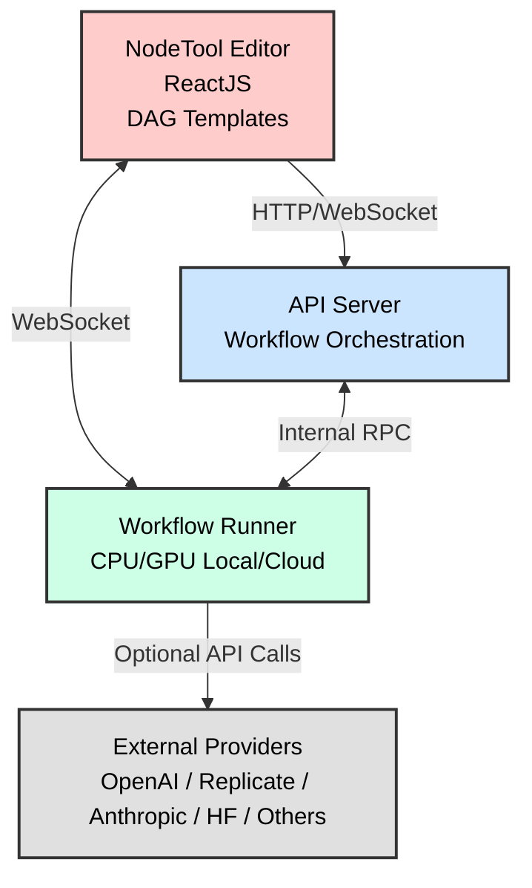

# NodeTool Core 

<h3>AI Workflow Engine</h3>

<p align="center">
  
  <a href="https://github.com/nodetool-ai/nodetool-core/actions/workflows/test.yml"></a>
  <a href="https://github.com/nodetool-ai/nodetool-core/actions/workflows/docker-publish.yaml"></a>
  
  
</p>

NodeTool Core is the open‑source Python engine that powers [NodeTool](https://github.com/nodetool-ai/nodetool).

______________________________________________________________________

## 🔑 Feature Highlights

- 🧩 **Node-Based DSL** – Declare graphs in pure Python or JSON; no vendor lock‑in.
- 🤖 **First‑Class Agents** – Planner, browser, search & tool‑calling baked in.
- 🌐 **Multi‑Provider Models** – OpenAI, Anthropic, Ollama, Hugging Face.
- 🔄 **RAG & Vector Stores** – Native adapters for Chroma.
- ⚡ **Actor-Based Execution Engine** – One actor per node, streaming-first.
- 🔌 **Plugin SDK** – Bring your own node.

______________________________________________________________________

## 🚀 Quick Start

### Installation

```bash
# Install using pip
pip install nodetool-core

# Or install from source (recommended for development)
git clone https://github.com/nodetool-ai/nodetool-core
cd nodetool-core

# Option 1: Using conda + uv (recommended - includes system dependencies)
conda create -n nodetool python=3.11 pandoc ffmpeg -c conda-forge
conda activate nodetool
uv sync

# Option 2: Using pip only
pip install .
# Note: Install pandoc and ffmpeg separately for full functionality
```

### Basic Usage

```python
import asyncio
import tempfile

from nodetool.nodes.lib.math import Add, Multiply
from nodetool.runtime.resources import ResourceScope
from nodetool.workflows.processing_context import ProcessingContext

async def main():
    async with ResourceScope():
        with tempfile.TemporaryDirectory() as workspace:
            context = ProcessingContext(workspace_dir=workspace)

            # Create and run a simple math workflow
            add_node = Add(a=5.0, b=3.0)
            result = await add_node.process(context)
            print(f"5 + 3 = {result}")  # 8.0

            # Chain operations
            multiply_node = Multiply(a=result, b=2.0)
            final = await multiply_node.process(context)
            print(f"(5 + 3) * 2 = {final}")  # 16.0

asyncio.run(main())
```

For workflow-based execution with AI models, see the examples in `examples/`.

### CLI Usage

```bash
python -m nodetool.cli --help
```

## 📖 Documentation

For comprehensive documentation, visit **[docs.nodetool.ai](https://docs.nodetool.ai)**

Key resources:
- [Getting Started](https://docs.nodetool.ai/getting-started.html)
- [CLI Reference](https://docs.nodetool.ai/cli.html)
- [API Reference](https://docs.nodetool.ai/api-reference.html)
- [Architecture](https://docs.nodetool.ai/architecture.html)
- [Agent System](https://docs.nodetool.ai/AGENTS.html)
- [Examples](examples/)

## 🏗️ Architecture

NodeTool's architecture is designed to be flexible and extensible.



### Execution TL;DR

```
•	Each node runs in its own async task. No central loop.
•	Every node has an input queue (NodeInbox) that delivers data in order and tracks when it ends.
•	Streaming nodes handle data piece by piece (gen_process); batch nodes handle all at once (process).
•	When finished or failing, nodes signal “done” downstream so others don’t wait forever.
•	GPU jobs run one at a time with a global lock, with retries and cleanup if memory runs out.
```

🤝 Contributing

We welcome contributions from the community! Please see our [Contributing Guidelines](./CONTRIBUTING.md) for more
information on how to get involved.

### Development Setup

This setup is for developing the `nodetool-core` library itself. If you want to set up the full NodeTool application
(UI, backend, etc.), please refer to the development setup instructions in the main
[NodeTool repository](https://github.com/nodetool-ai/nodetool).

1. **Clone the repository**

   ```bash
   git clone https://github.com/yourusername/nodetool-core.git
   cd nodetool-core
   ```

1. **Install dependencies**

   ```bash
   # Using conda + uv (recommended)
   conda create -n nodetool python=3.11 pandoc ffmpeg -c conda-forge
   conda activate nodetool
   uv sync --group dev

   # Or using pip only
   pip install .
   pip install -r requirements-dev.txt
   ```

1. **Environment Configuration**

   Set up your environment configuration for development:

   ```bash
   # Copy the example file to create your local config
   cp .env.example .env.development.local
   ```

   Edit `.env.development.local` and add your API keys:

   ```env
   # Required for most functionality
   OPENAI_API_KEY=your_openai_key_here
   ANTHROPIC_API_KEY=your_anthropic_key_here

   # Optional - add as needed
   GEMINI_API_KEY=your_gemini_key_here
   HF_TOKEN=your_huggingface_token_here
   REPLICATE_API_TOKEN=your_replicate_token_here
   ```

   > **Security Note**: Never commit `.env.*.local` files - they contain your actual API keys and are automatically
   > gitignored.

1. **Environment Files Overview**

   - `.env.example` - Template with all configuration options
   - `.env.development` - Development defaults (committed, no secrets)
   - `.env.test` - Test environment configuration
   - `.env.production` - Production configuration template
   - `.env.*.local` - Your actual secrets (gitignored)

   The system automatically loads the appropriate config based on your environment.

## 📄 License

[AGPL License](./LICENSE)

## 📚 Learn More

- [NodeTool Website](https://nodetool.ai)
- [Discord Community](https://discord.gg/nodetool)

#### Example 2: PDF Indexing for RAG Applications

This example shows how to create a workflow that loads a PDF document, extracts text, splits it into sentences, and
indexes the chunks in a ChromaDB vector database for later retrieval:

```python
import asyncio
import os
from nodetool.dsl.graph import graph, run_graph
from nodetool.dsl.chroma.collections import Collection
from nodetool.dsl.chroma.index import IndexTextChunks
from nodetool.dsl.lib.langchain import SentenceSplitter
from nodetool.dsl.lib.pymupdf import ExtractText
from nodetool.dsl.nodetool.os import LoadDocumentFile
from nodetool.metadata.types import FilePath, LlamaModel

# Set up paths
dirname = os.path.dirname(__file__)
file_path = os.path.join(dirname, "deepseek_r1.pdf")

# Create indexing workflow
g = IndexTextChunks(
    collection=Collection(name="papers"),
    text_chunks=SentenceSplitter(
        text=ExtractText(
            pdf=LoadDocumentFile(path=FilePath(path=file_path)),
        ),
        document_id=file_path,
    ),
)

# Run the workflow
asyncio.run(run_graph(graph(g)))
```

### Key Concepts

When using NodeTool programmatically, keep these key concepts in mind:

1. **Nodes**: Each node represents a specific operation or function. Nodes have inputs and outputs that can be connected
   to form a workflow.

1. **Graph**: A collection of nodes and their connections, representing the entire workflow.

1. **DSL (Domain-Specific Language)**: NodeTool provides a Python DSL for creating workflows, with specialized modules
   for different domains (e.g., `nodetool.dsl.google.mail`, `nodetool.dsl.chroma.collections`).

1. **Execution**: Workflows are executed using the `run_graph` function, which takes a graph object created with the
   `graph` function.

## Using the Workflow API 🔌

NodeTool provides a powerful Workflow API that allows you to integrate and run your AI workflows programmatically.

You can use the API locally now, `api.nodetool.ai` access is limited to Alpha users.

### API Usage

#### Loading Workflows

```javascript
const response = await fetch("http://localhost:7777/api/workflows/");
const workflows = await response.json();
```

#### Running a Workflow

##### HTTP API

```bash
curl -X POST "http://localhost:7777/api/workflows/<workflow_id>/run" \
-H "Content-Type: application/json" \
-d '{
    "params": {
        "param_name": "param_value"
    }
}'
```

```javascript
const response = await fetch(
  "http://localhost:7777/api/workflows/<workflow_id>/run",
  {
    method: "POST",
    headers: {
      "Content-Type": "application/json",
    },
    body: JSON.stringify({
      params: params,
    }),
  }
);

const outputs = await response.json();
// outputs is an object with one property for each output node in the workflow
// the value is the output of the node, which can be a string, image, audio, etc.
```

##### WebSocket API

The WebSocket API is useful for getting real-time updates on the status of the workflow. It is similar to the streaming
API, but it uses a more efficient binary encoding. It offers additional features like canceling jobs.

See [run_workflow_websocket.js](examples/run_workflow_websocket.js) for an example.

```javascript
const socket = new WebSocket("ws://localhost:7777/predict");

const request = {
  type: "run_job_request",
  workflow_id: "YOUR_WORKFLOW_ID",
  params: {
    /* workflow parameters */
  },
};

// Run a workflow
socket.send(
  msgpack.encode({
    command: "run_job",
    data: request,
  })
);

// Handle messages from the server
socket.onmessage = async (event) => {
  const data = msgpack.decode(new Uint8Array(await event.data.arrayBuffer()));
  if (data.type === "job_update" && data.status === "completed") {
    console.log("Workflow completed:", data.result);
  } else if (data.type === "node_update") {
    console.log("Node update:", data.node_name, data.status, data.error);
  } else if (data.type === "node_progress") {
    console.log("Progress:", (data.progress / data.total) * 100);
  }
  // Handle other message types as needed
};

// Cancel a running job
socket.send(msgpack.encode({ command: "cancel_job" }));

// Get the status of the job
socket.send(msgpack.encode({ command: "get_status" }));
```

## Configuration

NodeTool Core uses environment-specific configuration files for managing different deployment scenarios. The
configuration system supports multiple environments with automatic loading based on context.

### Configuration Files

- **`.env.example`** - Complete template with all available options
- **`.env.development`** - Development environment defaults
- **`.env.test`** - Test environment configuration
- **`.env.production`** - Production environment template
- **`.env.*.local`** - Local overrides with actual secrets (gitignored)

### Loading Priority

Configuration is loaded in this order (later sources override earlier ones):

1. Default values from code
1. Base `.env` file
1. Environment-specific file (`.env.development`, `.env.test`, or `.env.production`)
1. Local override file (`.env.{environment}.local`)
1. System environment variables
1. YAML settings/secrets files

### Environment Variables

#### Core Configuration

| Variable      | Description                                            | Default       |
| ------------- | ------------------------------------------------------ | ------------- |
| `ENV`         | Environment name (`development`, `test`, `production`) | `development` |
| `DEBUG`       | Enable debug mode                                      | `None`        |
| `LOG_LEVEL`   | Logging level                                          | `INFO`        |
| `REMOTE_AUTH` | Enable remote authentication                           | `0`           |

#### AI Providers & APIs

| Variable              | Description                             | Group        |
| --------------------- | --------------------------------------- | ------------ |
| `OPENAI_API_KEY`      | OpenAI API key for GPT models, DALL-E   | LLM          |
| `ANTHROPIC_API_KEY`   | Anthropic API key for Claude models     | LLM          |
| `GEMINI_API_KEY`      | Google Gemini API key                   | LLM          |
| `HF_TOKEN`            | Hugging Face token for gated models     | Hugging Face |
| `REPLICATE_API_TOKEN` | Replicate API token                     | Replicate    |
| `ELEVENLABS_API_KEY`  | ElevenLabs text-to-speech API key       | ElevenLabs   |
| `FAL_API_KEY`         | FAL.ai serverless AI infrastructure key | FAL          |
| `AIME_USER`           | Aime service username                   | Aime         |
| `AIME_API_KEY`        | Aime API key                            | Aime         |

#### Database & Storage

| Variable            | Description              | Default                               |
| ------------------- | ------------------------ | ------------------------------------- |
| `DB_PATH`           | SQLite database path     | `~/.config/nodetool/nodetool.sqlite3` |
| `SUPABASE_URL`      | Supabase project URL     | -                                     |
| `SUPABASE_KEY`      | Supabase service key     | -                                     |

#### Cloud Storage (S3)

| Variable               | Description                    | Default     |
| ---------------------- | ------------------------------ | ----------- |
| `ASSET_BUCKET`         | S3 bucket for assets           | `images`    |
| `ASSET_TEMP_BUCKET`    | S3 bucket for temporary assets | -           |
| `ASSET_DOMAIN`         | Asset CDN domain               | -           |
| `ASSET_TEMP_DOMAIN`    | Temporary asset domain         | -           |
| `S3_ACCESS_KEY_ID`     | AWS access key ID              | -           |
| `S3_SECRET_ACCESS_KEY` | AWS secret access key          | -           |
| `S3_ENDPOINT_URL`      | S3 endpoint URL                | -           |
| `S3_REGION`            | S3 region                      | -           |
| `AWS_REGION`           | AWS region                     | `us-east-1` |

#### Vector Database & AI Services

| Variable         | Description                   | Default                          |
| ---------------- | ----------------------------- | -------------------------------- |
| `CHROMA_PATH`    | ChromaDB storage path         | `~/.local/share/nodetool/chroma` |
| `CHROMA_URL`     | Remote ChromaDB URL           | -                                |
| `CHROMA_TOKEN`   | ChromaDB authentication token | -                                |
| `OLLAMA_API_URL` | Ollama API endpoint           | `http://127.0.0.1:11434`         |
| `OLLAMA_MODELS`  | Custom Ollama models path     | -                                |

#### External Integrations

| Variable                | Description                         | Group      |
| ----------------------- | ----------------------------------- | ---------- |
| `GOOGLE_MAIL_USER`      | Gmail address for email integration | Google     |
| `GOOGLE_APP_PASSWORD`   | Google app password                 | Google     |
| `SERPAPI_API_KEY`       | SerpAPI key for web scraping        | SerpAPI    |
| `DATA_FOR_SEO_LOGIN`    | DataForSEO login                    | DataForSEO |
| `DATA_FOR_SEO_PASSWORD` | DataForSEO password                 | DataForSEO |
| `BROWSER_URL`           | Browser automation endpoint         | Browser    |

#### System & Media Processing

| Variable       | Description                       | Default   |
| -------------- | --------------------------------- | --------- |
| `FFMPEG_PATH`  | Path to ffmpeg executable         | `ffmpeg`  |
| `FFPROBE_PATH` | Path to ffprobe executable        | `ffprobe` |
| `FONT_PATH`    | Font directory for text rendering | -         |
| `COMFY_FOLDER` | ComfyUI integration folder        | -         |

#### Deployment & Monitoring

| Variable         | Description                         | Default |
| ---------------- | ----------------------------------- | ------- |
| `RUNPOD_API_KEY` | RunPod API key for cloud deployment | -       |
| `MEMCACHE_HOST`  | Memcache server host                | -       |
| `MEMCACHE_PORT`  | Memcache server port                | -       |

### Environment Detection

The system automatically detects the environment from:

`ENV` environment variable. Defaults to "development"

For a complete template with all options, see `.env.example` in the repository.

## Development

### Setup

1. Clone the repository

1. Install dependencies :

   ```bash
   # Using conda + uv (recommended)
   conda create -n nodetool python=3.11 pandoc ffmpeg -c conda-forge
   conda activate nodetool
   uv sync

   # Or using pip only
   pip install .
   ```

### Testing

Run tests with pytest:

```bash
# Using uv (recommended)
uv run pytest

# Or directly if using activated environment
pytest
```

### Code Quality & Pre-Commit Hooks

This repository uses pre-commit hooks to ensure code quality and consistency.

**Setup:**

```bash
# Install pre-commit
pip install pre-commit

# Install git hooks
pre-commit install
```

**What gets checked:**

- Ruff linting and formatting (replaces black + flake8)
- Trailing whitespace and file endings
- YAML/JSON validation
- Markdown formatting

**Running manually:**

```bash
# Run all hooks on all files
pre-commit run --all-files

# Run on staged files only
pre-commit run

# Run specific hook
pre-commit run ruff --all-files
```

Hooks run automatically on `git commit`. If they fail or make changes, stage the changes and commit again.

## License

[AGPL License](LICENSE)
