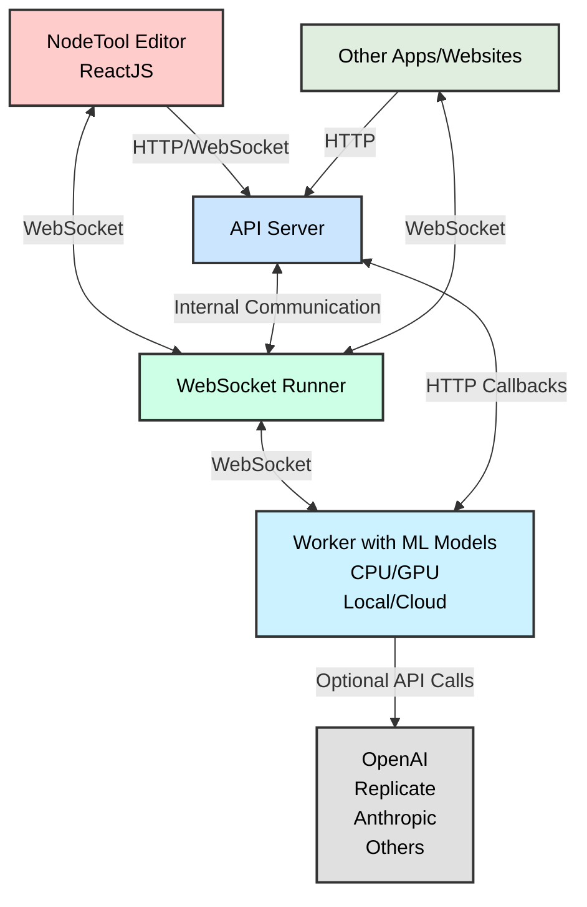

# NodeTool Core 

<h3>Swiss‑Army Knife for AI Builders</h3>

<p align="center">
  
  
  
  
</p>

> **Drag, drop, deploy — the backend that snaps every AI model into one graph.**

NodeTool Core is the open‑source Python engine that powers [NodeTool Studio](https://github.com/nodetool-ai/nodetool) (desktop) and **NodeTool Scale** (cloud). It turns your laptop into an all‑terrain lab for **agentic, multi‑modal, production‑ready workflows.**

---

## ✨ Why Nodetool?

| Pillar    | What it means                                                                         |
| --------- | ------------------------------------------------------------------------------------- |
| **Snap**  | Compose LLMs, diffusers, audio models, REST calls & agents as Lego‑like nodes.        |
| **Scale** | Run locally for privacy, then burst to the cloud or GPU farm with identical graphs.   |
| **Ship**  | Expose any workflow as a REST/WebSocket API, CLI, or shareable template—zero rewrite. |

---

## 🔑 Feature Highlights

- 🧩 **Node-Based DSL** – Declare graphs in pure Python or JSON; no vendor lock‑in.
- 🤖 **First‑Class Agents** – Planner, browser, search & tool‑calling baked in.
- 🌐 **Multi‑Provider Models** – OpenAI, Anthropic, Ollama, Hugging Face.
- 🔄 **RAG & Vector Stores** – Native adapters for Chroma.
- ⚡ **Actor-Based Execution Engine** – One actor per node, streaming-first.
- 🔌 **Plugin SDK** – Bring your own node.

---

## 🚀 Quick Start

### Installation

```bash
# Install using pip
pip install nodetool-core
```

### Basic Usage

```python
import asyncio
from nodetool.dsl.graph import graph, run_graph
from nodetool.dsl.providers.openai import ChatCompletion
from nodetool.metadata.types import OpenAIModel

# Create a simple workflow
g = ChatCompletion(
    model=OpenAIModel(model="gpt-4"),
    messages=[{"role": "user", "content": "Explain quantum computing in simple terms"}]
)

# Run the workflow
result = asyncio.run(run_graph(graph(g)))
print(result)
```

### CLI Usage

```bash
python -m nodetool.cli --help
```

See [docs/cli.md](docs/cli.md) for all commands.

## 📖 Documentation

- [Concepts and Architecture](https://docs.nodetool.ai/concepts/)
- [Getting Started Guide](https://docs.nodetool.ai/getting-started/)
- [API Reference](https://docs.nodetool.ai/api-reference/)
- [Examples](https://docs.nodetool.ai/examples/)
- [Advanced Usage](https://docs.nodetool.ai/advanced/)

## 🏗️ Architecture

NodeTool's architecture is designed to be flexible and extensible.



### Execution TL;DR

- One async task (NodeActor) per node; no central scheduler loop.
- Inputs delivered via per-node `NodeInbox` (FIFO per handle) with EOS tracking.
- Streaming nodes implement `gen_process` to yield incrementally; batch nodes use `process` once.
- On completion or error, actors mark downstream EOS to avoid hangs.
- GPU work is serialized with a global async lock; OOM retries and cleanup.

## 🤝 Contributing

We welcome contributions from the community! Please see our [Contributing Guidelines](./CONTRIBUTING.md) for more information on how to get involved.

### Development Setup

This setup is for developing the `nodetool-core` library itself using Poetry. If you want to set up the full NodeTool application (UI, backend, etc.), please refer to the development setup instructions in the main [NodeTool repository](https://github.com/nodetool-ai/nodetool).

1. Clone the repository

   ```bash
   git clone https://github.com/yourusername/nodetool-core.git
   cd nodetool-core
   ```

2. Install dependencies with Poetry

   ```bash
   poetry install
   ```

## 📄 License

[AGPL License](./LICENSE)

## 📚 Learn More

- [NodeTool Website](https://nodetool.ai)
- [Discord Community](https://discord.gg/nodetool)

#### Example 2: PDF Indexing for RAG Applications

This example shows how to create a workflow that loads a PDF document, extracts text, splits it into sentences, and indexes the chunks in a ChromaDB vector database for later retrieval:

```python
import asyncio
import os
from nodetool.dsl.graph import graph, run_graph
from nodetool.dsl.chroma.collections import Collection
from nodetool.dsl.chroma.index import IndexTextChunks
from nodetool.dsl.lib.langchain import SentenceSplitter
from nodetool.dsl.lib.pymupdf import ExtractText
from nodetool.dsl.nodetool.os import LoadDocumentFile
from nodetool.metadata.types import FilePath, LlamaModel

# Set up paths
dirname = os.path.dirname(__file__)
file_path = os.path.join(dirname, "deepseek_r1.pdf")

# Create indexing workflow
g = IndexTextChunks(
    collection=Collection(name="papers"),
    text_chunks=SentenceSplitter(
        text=ExtractText(
            pdf=LoadDocumentFile(path=FilePath(path=file_path)),
        ),
        document_id=file_path,
    ),
)

# Run the workflow
asyncio.run(run_graph(graph(g)))
```

### Key Concepts

When using NodeTool programmatically, keep these key concepts in mind:

1. **Nodes**: Each node represents a specific operation or function. Nodes have inputs and outputs that can be connected to form a workflow.

2. **Graph**: A collection of nodes and their connections, representing the entire workflow.

3. **DSL (Domain-Specific Language)**: NodeTool provides a Python DSL for creating workflows, with specialized modules for different domains (e.g., `nodetool.dsl.google.mail`, `nodetool.dsl.chroma.collections`).

4. **Execution**: Workflows are executed using the `run_graph` function, which takes a graph object created with the `graph` function.

## Using the Workflow API 🔌

NodeTool provides a powerful Workflow API that allows you to integrate and run your AI workflows programmatically.

You can use the API locally now, `api.nodetool.ai` access is limited to Alpha users.

### API Usage

#### Loading Workflows

```javascript
const response = await fetch("http://localhost:8000/api/workflows/");
const workflows = await response.json();
```

#### Running a Workflow

##### HTTP API

```bash
curl -X POST "http://localhost:8000/api/workflows/<workflow_id>/run" \
-H "Content-Type: application/json" \
-d '{
    "params": {
        "param_name": "param_value"
    }
}'
```

```javascript
const response = await fetch(
  "http://localhost:8000/api/workflows/<workflow_id>/run",
  {
    method: "POST",
    headers: {
      "Content-Type": "application/json",
    },
    body: JSON.stringify({
      params: params,
    }),
  }
);

const outputs = await response.json();
// outputs is an object with one property for each output node in the workflow
// the value is the output of the node, which can be a string, image, audio, etc.
```

##### WebSocket API

The WebSocket API is useful for getting real-time updates on the status of the workflow.
It is similar to the streaming API, but it uses a more efficient binary encoding.
It offers additional features like canceling jobs.

See [run_workflow_websocket.js](examples/run_workflow_websocket.js) for an example.

```javascript
const socket = new WebSocket("ws://localhost:8000/predict");

const request = {
  type: "run_job_request",
  workflow_id: "YOUR_WORKFLOW_ID",
  params: {
    /* workflow parameters */
  },
};

// Run a workflow
socket.send(
  msgpack.encode({
    command: "run_job",
    data: request,
  })
);

// Handle messages from the server
socket.onmessage = async (event) => {
  const data = msgpack.decode(new Uint8Array(await event.data.arrayBuffer()));
  if (data.type === "job_update" && data.status === "completed") {
    console.log("Workflow completed:", data.result);
  } else if (data.type === "node_update") {
    console.log("Node update:", data.node_name, data.status, data.error);
  } else if (data.type === "node_progress") {
    console.log("Progress:", (data.progress / data.total) * 100);
  }
  // Handle other message types as needed
};

// Cancel a running job
socket.send(msgpack.encode({ command: "cancel_job" }));

// Get the status of the job
socket.send(msgpack.encode({ command: "get_status" }));
```

## Configuration

### Environment Variables

The following environment variables can be used to configure the library:

| Variable       | Description                    | Default   |
| -------------- | ------------------------------ | --------- |
| `FFMPEG_PATH`  | Path to the ffmpeg executable  | `ffmpeg`  |
| `FFPROBE_PATH` | Path to the ffprobe executable | `ffprobe` |

These variables are useful when you need to specify custom binary paths for media processing tools, especially in Docker containers or CI/CD environments.

## Development

### Setup

1. Clone the repository
2. Install dependencies :
   ```bash
   pip install .
   ```

### Testing

Run tests with pytest:

```bash
poetry run pytest
```

## License

[AGPL License](LICENSE)
