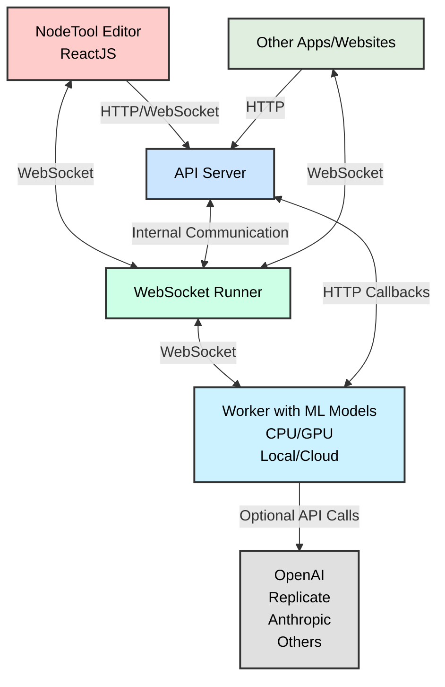
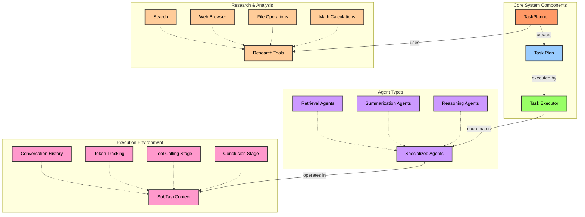

# NodeTool Core 

<p align="center">
  
  
  
  
  
</p>

<p align="center">
  <b>Powerful, Flexible Node-Based Workflows for AI Applications</b>
</p>

<p align="center">
  
</p>

## 📚 Overview

NodeTool Core is a powerful Python library for building and running AI workflows using a modular, node-based approach. It provides the foundation for the NodeTool ecosystem, enabling developers to create sophisticated AI applications with minimal code.

### ✨ Key Features

- 🔄 **Node-based workflow system** - Compose complex workflows from simple building blocks
- 🤖 **Multi-provider AI support** - Seamless integration with OpenAI, Anthropic, Ollama, and more
- 🧩 **Modular architecture** - Easily extend with custom nodes and functionality
- ⚡ **High-performance execution engine** - Run workflows efficiently on CPU or GPU
- 🔄 **Workflow streaming API** - Get real-time updates on workflow progress
- 🧠 **Advanced agent system** - Create intelligent agents with specialized capabilities
- 💾 **Storage and persistence** - Save and manage workflows and results
- 📊 **Type system** - Strong typing for workflow validation and documentation

## 🚀 Quick Start

### Installation

```bash
# Install using pip
pip install nodetool-core

# Or with Poetry
poetry add nodetool-core
```

### Basic Usage

```python
import asyncio
from nodetool.dsl.graph import graph, run_graph
from nodetool.dsl.providers.openai import ChatCompletion
from nodetool.metadata.types import OpenAIModel

# Create a simple workflow
g = ChatCompletion(
    model=OpenAIModel(model="gpt-4"),
    messages=[{"role": "user", "content": "Explain quantum computing in simple terms"}]
)

# Run the workflow
result = asyncio.run(run_graph(graph(g)))
print(result)
```

## 📖 Documentation

Comprehensive documentation is available at [docs.nodetool.ai](https://docs.nodetool.ai).

- [Concepts and Architecture](https://docs.nodetool.ai/concepts/)
- [Getting Started Guide](https://docs.nodetool.ai/getting-started/)
- [API Reference](https://docs.nodetool.ai/api-reference/)
- [Examples](https://docs.nodetool.ai/examples/)
- [Advanced Usage](https://docs.nodetool.ai/advanced/)

## 🧩 Examples

### Email Summarization

This example demonstrates how to create a workflow that retrieves recent emails from Gmail, formats them, and generates a summary using advanced AI agents:

```python
import asyncio
from nodetool.chat.agent import Agent
from nodetool.chat.task_planner import TaskPlanner
from nodetool.chat.providers.anthropic import AnthropicProvider
from nodetool.chat.tools.email import GmailTool
from nodetool.chat.tools.web import SearchTool, BrowserTool
from nodetool.chat.tools.basic import FinishSubtaskTool
from nodetool.metadata.types import TaskPlan

# Initialize a provider
provider = AnthropicProvider(api_key="your-api-key")

# Create specialized agents
research_agent = Agent(
    name="EmailRetriever",
    objective="Gather and organize recent emails",
    description="Specialized in retrieving and organizing email content",
    provider=provider,
    model="claude-3-opus-20240229",
    workspace_dir="./workspace",
    tools=[GmailTool(), FinishSubtaskTool()],
    system_prompt="You retrieve and organize email information. Focus on sender, subject, and key content.",
    max_steps=20
)

summary_agent = Agent(
    name="EmailSummarizer",
    objective="Create concise summaries of email collections",
    description="Specialized in analyzing and summarizing multiple emails",
    provider=provider,
    model="claude-3-opus-20240229",
    workspace_dir="./workspace",
    tools=[SearchTool(), BrowserTool(), FinishSubtaskTool()],
    system_prompt="You are a summarizer. Create concise, well-structured summaries of email collections.",
    max_steps=30
)

# Initialize the task planner
planner = TaskPlanner(
    provider=provider,
    model="claude-3-opus-20240229",
    objective="Retrieve recent emails and create a comprehensive summary",
    workspace_dir="./workspace",
    tools=[GmailTool(), SearchTool(), BrowserTool()],
    agents=[research_agent, summary_agent],
    max_research_iterations=2
)

async def process_emails():
    # Create the plan
    print("Creating task plan...")
    async for chunk in planner.create_plan():
        print(chunk.content)

    # Get the task plan
    task_plan = planner.task_plan
    print(f"Task plan created with {len(task_plan.tasks)} tasks")

    # Execute tasks for each agent
    results = {}
    for task in task_plan.tasks:
        print(f"\nExecuting task: {task.name} with agent: {task.agent_name}")

        if task.agent_name == "EmailRetriever":
            async for item in research_agent.execute_task(task_plan, task):
                print(f"Research agent: {item.content if hasattr(item, 'content') else item}")

        elif task.agent_name == "EmailSummarizer":
            async for item in summary_agent.execute_task(task_plan, task):
                print(f"Summary agent: {item.content if hasattr(item, 'content') else item}")

# Run the workflow
asyncio.run(process_emails())
```

More examples can be found in the [examples](./examples) directory.

## 🏗️ Architecture

NodeTool's architecture is designed to be flexible and extensible.



## 🤝 Contributing

We welcome contributions from the community! Please see our [Contributing Guidelines](./CONTRIBUTING.md) for more information on how to get involved.

### Development Setup

1. Clone the repository

   ```bash
   git clone https://github.com/yourusername/nodetool-core.git
   cd nodetool-core
   ```

2. Install dependencies with Poetry

   ```bash
   poetry install
   ```

3. Install pre-commit hooks

   ```bash
   pre-commit install
   ```

4. Run tests
   ```bash
   poetry run pytest
   ```

## 📄 License

[AGPL License](./LICENSE)

## 🌟 Showcase

Here are some projects built with NodeTool Core:

- [Project 1](https://example.com) - Description of project 1
- [Project 2](https://example.com) - Description of project 2
- [Project 3](https://example.com) - Description of project 3

## 📚 Learn More

- [NodeTool Website](https://nodetool.ai)
- [Discord Community](https://discord.gg/nodetool)
- [Twitter](https://twitter.com/nodetool)
- [Blog](https://blog.nodetool.ai)

## Features

- Node-based workflow system for AI applications
- Support for various AI providers (OpenAI, Anthropic, etc.)
- Storage and persistence mechanisms
- Workflow execution engine
- Type system for workflow nodes

## Using NodeTool Programmatically

While NodeTool offers a powerful visual interface through its main application, you can also use NodeTool Core directly in your Python code to create and run workflows programmatically. This approach gives you the flexibility to integrate NodeTool's capabilities into your existing applications or scripts.

### Creating and Running Workflows in Python

NodeTool uses a declarative, node-based approach to define workflows. Each node represents a specific operation, and nodes are connected to form a graph that represents the workflow.

Here are examples of how to use NodeTool programmatically for different use cases:

#### Example 1: Email Summarization

This example demonstrates how to create a workflow that retrieves recent emails from Gmail, formats them, and generates a summary using the Llama model via Ollama:

```python
import asyncio
from nodetool.chat.agent import Agent
from nodetool.chat.task_planner import TaskPlanner
from nodetool.chat.providers.anthropic import AnthropicProvider
from nodetool.chat.tools.email import GmailTool
from nodetool.chat.tools.web import SearchTool, BrowserTool
from nodetool.chat.tools.basic import FinishSubtaskTool
from nodetool.metadata.types import TaskPlan

# Initialize a provider
provider = AnthropicProvider(api_key="your-api-key")

# Create specialized agents
research_agent = Agent(
    name="EmailRetriever",
    objective="Gather and organize recent emails",
    description="Specialized in retrieving and organizing email content",
    provider=provider,
    model="claude-3-opus-20240229",
    workspace_dir="./workspace",
    tools=[GmailTool(), FinishSubtaskTool()],
    system_prompt="You retrieve and organize email information. Focus on sender, subject, and key content.",
    max_steps=20
)

summary_agent = Agent(
    name="EmailSummarizer",
    objective="Create concise summaries of email collections",
    description="Specialized in analyzing and summarizing multiple emails",
    provider=provider,
    model="claude-3-opus-20240229",
    workspace_dir="./workspace",
    tools=[SearchTool(), BrowserTool(), FinishSubtaskTool()],
    system_prompt="You are a summarizer. Create concise, well-structured summaries of email collections.",
    max_steps=30
)

# Initialize the task planner
planner = TaskPlanner(
    provider=provider,
    model="claude-3-opus-20240229",
    objective="Retrieve recent emails and create a comprehensive summary",
    workspace_dir="./workspace",
    tools=[GmailTool(), SearchTool(), BrowserTool()],
    agents=[research_agent, summary_agent],
    max_research_iterations=2
)

async def process_emails():
    # Create the plan
    print("Creating task plan...")
    async for chunk in planner.create_plan():
        print(chunk.content)

    # Get the task plan
    task_plan = planner.task_plan
    print(f"Task plan created with {len(task_plan.tasks)} tasks")

    # Execute tasks for each agent
    results = {}
    for task in task_plan.tasks:
        print(f"\nExecuting task: {task.name} with agent: {task.agent_name}")

        if task.agent_name == "EmailRetriever":
            async for item in research_agent.execute_task(task_plan, task):
                print(f"Research agent: {item.content if hasattr(item, 'content') else item}")

        elif task.agent_name == "EmailSummarizer":
            async for item in summary_agent.execute_task(task_plan, task):
                print(f"Summary agent: {item.content if hasattr(item, 'content') else item}")

    print("\nEmail processing complete!")
    print(results)

# Run the workflow
asyncio.run(process_emails())
```

#### Example 2: PDF Indexing for RAG Applications

This example shows how to create a workflow that loads a PDF document, extracts text, splits it into sentences, and indexes the chunks in a ChromaDB vector database for later retrieval:

```python
import asyncio
import os
from nodetool.dsl.graph import graph, run_graph
from nodetool.dsl.chroma.collections import Collection
from nodetool.dsl.chroma.index import IndexTextChunks
from nodetool.dsl.lib.data.langchain import SentenceSplitter
from nodetool.dsl.lib.file.pymupdf import ExtractText
from nodetool.dsl.nodetool.os import LoadDocumentFile
from nodetool.metadata.types import FilePath, LlamaModel

# Set up paths
dirname = os.path.dirname(__file__)
file_path = os.path.join(dirname, "deepseek_r1.pdf")

# Create indexing workflow
g = IndexTextChunks(
    collection=Collection(name="papers"),
    text_chunks=SentenceSplitter(
        text=ExtractText(
            pdf=LoadDocumentFile(path=FilePath(path=file_path)),
        ),
        document_id=file_path,
    ),
)

# Run the workflow
asyncio.run(run_graph(graph(g)))
```

### Key Concepts

When using NodeTool programmatically, keep these key concepts in mind:

1. **Nodes**: Each node represents a specific operation or function. Nodes have inputs and outputs that can be connected to form a workflow.

2. **Graph**: A collection of nodes and their connections, representing the entire workflow.

3. **DSL (Domain-Specific Language)**: NodeTool provides a Python DSL for creating workflows, with specialized modules for different domains (e.g., `nodetool.dsl.google.mail`, `nodetool.dsl.chroma.collections`).

4. **Execution**: Workflows are executed using the `run_graph` function, which takes a graph object created with the `graph` function.

## Workflow Execution Architecture

NodeTool Core includes a sophisticated workflow execution engine that processes directed graphs of computational nodes. Understanding how workflows are executed can help you build more efficient and effective workflows.

### WorkflowRunner

The `WorkflowRunner` class is the heart of NodeTool's execution engine. It handles:

- Parallel execution of independent nodes
- GPU resource management with ordered locking
- Result caching for cacheable nodes
- Error handling and retry logic for GPU OOM situations
- Progress tracking and status updates
- Support for both regular nodes and group nodes (subgraphs)

### Execution Process

When you run a workflow, the following steps occur:

1. **Initialization**: The runner is initialized with a job ID and automatically detects the available device (CPU, CUDA, or MPS).

2. **Graph Loading**: The workflow graph is loaded from the request, and nodes are instantiated.

3. **Input Processing**: Input parameters are assigned to the corresponding input nodes.

4. **Graph Validation**: The graph is validated to ensure all edges are valid and all required inputs are provided.

5. **Node Initialization**: All nodes in the graph are initialized.

6. **Graph Processing**:

   - Nodes without incoming edges are processed first
   - As nodes complete, messages are sent to downstream nodes
   - Nodes are processed when all their required inputs are available
   - GPU-intensive nodes acquire a lock before execution to manage resources

7. **Result Collection**: Results from output nodes are collected and returned.

8. **Finalization**: Resources are cleaned up, and the final status is reported.

### Advanced Features

- **Parallel Execution**: Independent nodes are executed in parallel using asyncio.
- **GPU Management**: The runner intelligently manages GPU resources, with retry logic for out-of-memory situations.
- **Subgraph Support**: Group nodes can contain entire subgraphs, enabling hierarchical workflows.
- **Progress Tracking**: The runner provides real-time progress updates during execution.

### Code Example: Creating a Custom WorkflowRunner

For advanced use cases, you can create and use a WorkflowRunner directly:

```python
from nodetool.workflows.workflow_runner import WorkflowRunner
from nodetool.workflows.run_job_request import RunJobRequest
from nodetool.workflows.processing_context import ProcessingContext

# Create a runner with a unique job ID
runner = WorkflowRunner(job_id="my-custom-job-123")

# Create a request with your graph and parameters
request = RunJobRequest(graph=my_graph, params=my_params)

# Create a processing context
context = ProcessingContext()

# Run the workflow
await runner.run(request, context)

# Access results from the context
results = context.get_results()
```

## Agent System

The NodeTool Agent System provides a powerful framework for building intelligent agents that can solve complex problems through reasoning, research, and collaboration.

### Overview

The NodeTool Agent System provides:

- **Strategic Task Planning**: Break down complex objectives into structured, executable plans
- **Chain of Thought Reasoning**: Enable step-by-step problem solving with explicit reasoning
- **Multi-Agent Coordination**: Orchestrate specialized agents with different capabilities
- **Sophisticated Tool Integration**: Provide agents with capabilities like web browsing, file operations, and more
- **Context Management**: Efficiently handle context limitations through automatic summarization
- **Streaming Results**: Get live updates during the reasoning and execution process

### Architecture

The system is composed of three primary components:

1. **Agents**: Specialized problem-solvers with specific capabilities and objectives
2. **Task Planner**: Creates structured, dependency-aware execution plans
3. **Task Execution System**: Executes plans while managing resources and tracking progress



### Key Components

#### Agent Base Class

The `Agent` class is the foundation for specialized agents with different capabilities:

- **Retrieval Agents**: Focus on gathering information from external sources
- **Summarization Agents**: Synthesize and condense information efficiently
- **Reasoning Agents**: Apply logical thinking to solve analytical problems

Each agent is configured with:

- A specific objective and description
- LLM provider and model
- Available tools
- System prompt tailored to its role
- Workspace for storing results

#### Task Planner

The `TaskPlanner` strategically decomposes complex objectives into manageable tasks:

- Conducts initial research to inform planning
- Creates a directed acyclic graph (DAG) of tasks with dependencies
- Optimizes for parallel execution where possible
- Assigns tasks to appropriate specialized agents
- Saves plans for later execution or review

Planning follows a structured approach:

1. **Research Phase**: Gather relevant information to inform the plan
2. **Decomposition**: Break down the objective into sub-goals
3. **Task Creation**: Design specific tasks for each agent type
4. **Dependency Mapping**: Establish relationships between tasks

#### SubTaskContext

The `SubTaskContext` provides an isolated execution environment for each subtask:

- Manages conversation history and token tracking
- Implements a two-stage execution model:
  - **Tool Calling Stage**: Multiple iterations of information gathering using any tools
  - **Conclusion Stage**: Final synthesis with restricted access (only finish_subtask tool)
- Handles automatic context summarization when token limits are exceeded
- Tracks progress and enforces execution constraints

### Usage Examples

#### Creating a Basic Agent

```python
from nodetool.chat.agent import Agent
from nodetool.chat.providers.anthropic import AnthropicProvider

# Initialize a provider
provider = AnthropicProvider(api_key="your-api-key")

# Create a retrieval agent
retrieval_agent = Agent(
    name="Researcher",
    objective="Gather comprehensive information about quantum computing",
    description="Specialized in efficient information retrieval from the web",
    provider=provider,
    model="claude-3-opus-20240229",
    workspace_dir="./workspace",
    tools=[SearchTool(), BrowserTool()],
    system_prompt=RETRIEVAL_SYSTEM_PROMPT,
    max_steps=50
)
```

#### Creating and Executing a Task Plan

```python
from nodetool.chat.task_planner import TaskPlanner
from nodetool.metadata.types import TaskPlan

# Create specialized agents
retrieval_agent = Agent(...)
summary_agent = Agent(...)

# Initialize the task planner
planner = TaskPlanner(
    provider=provider,
    model="claude-3-opus-20240229",
    objective="Research and summarize recent advances in quantum computing",
    workspace_dir="./workspace",
    tools=[SearchTool(), BrowserTool()],
    agents=[retrieval_agent, summary_agent],
    max_research_iterations=3
)

# Create the plan
async for chunk in planner.create_plan():
    print(chunk.content)

# Get the task plan
task_plan = planner.task_plan

# Execute a task for a specific agent
async for item in retrieval_agent.execute_task(task_plan, task_plan.tasks[0]):
    if isinstance(item, Chunk):
        print(item.content)
```

#### Creating a Multi-Agent System

```python
# Create specialized agents
retrieval_agent = Agent(
    name="Researcher",
    objective="Gather information",
    # ... other parameters ...
)

summary_agent = Agent(
    name="Summarizer",
    objective="Create concise summaries",
    # ... other parameters ...
)

# Initialize task planner
planner = TaskPlanner(
    provider=provider,
    model="claude-3-opus-20240229",
    objective="Research and summarize quantum computing advances",
    workspace_dir="./workspace",
    tools=[SearchTool(), BrowserTool()],
    agents=[retrieval_agent, summary_agent]
)

# Create and execute the plan
async for chunk in planner.create_plan():
    print(chunk.content)

# Execute tasks for each agent
task_plan = planner.task_plan
for task in task_plan.tasks:
    if task.agent_name == "Researcher":
        async for item in retrieval_agent.execute_task(task_plan, task):
            print(item.content)
    elif task.agent_name == "Summarizer":
        async for item in summary_agent.execute_task(task_plan, task):
            print(item.content)
```

### System Prompts

The system includes specialized prompts for different agent types:

- **RETRIEVAL_SYSTEM_PROMPT**: Optimized for information gathering with emphasis on supplementary file downloads and focused search
- **SUMMARIZATION_SYSTEM_PROMPT**: Designed for efficient synthesis of information with proper citations
- **DETAILED_COT_SYSTEM_PROMPT**: Enables structured chain-of-thought reasoning for complex analytical tasks
- **DEFAULT_PLANNING_SYSTEM_PROMPT**: Guides the creation of optimal task plans with dependency management

### Advanced Features

#### Context Management

The system automatically manages token limits through:

- Token counting and tracking for conversation history
- Automatic summarization when limits are approached
- Preserving critical information during summarization

#### Tool Integration

Agents can use various tools:

- Web browsing and search tools
- File operations (read/write)
- Mathematical calculations
- Custom domain-specific tools

#### Two-Stage Execution Model

Complex tasks are executed in two phases:

1. **Tool Calling Stage**: Information gathering using any available tools
2. **Conclusion Stage**: Final synthesis with restricted tools (only finish_subtask)

This ensures agents properly conclude their reasoning and produce final outputs.

### Integration with NodeTool Core

The Agent System is designed to work seamlessly with the broader NodeTool ecosystem:

- Nodes can utilize agents for specific workflow steps
- Results from agent tasks can feed into NodeTool workflows
- Agents can leverage NodeTool's existing provider integrations (OpenAI, Anthropic, Ollama)

### Limitations and Considerations

- **Token Limits**: LLMs have context window limitations that may require summarization during complex tasks
- **Tool Constraints**: Each tool has specific capabilities and limitations
- **Model Capabilities**: Different LLMs have varying reasoning abilities and should be selected appropriately
- **Task Complexity**: Very complex objectives may need careful decomposition into subtasks

### Advanced Examples

For more detailed examples, see the examples directory:

1. **Retrieval Agent**: Demonstrates simple information gathering
2. **Task Planning and Execution**: Shows separation of planning and execution phases
3. **Multi-Agent Coordination**: Illustrates how multiple specialized agents work together

### Next Steps

After understanding the basics:

1. Create custom agents for your specific use cases
2. Develop new tools to expand agent capabilities
3. Build multi-agent systems with specialized roles
4. Integrate these capabilities into your NodeTool workflows

For more information, refer to the main NodeTool documentation.

## Architecture 🏗️

NodeTool's architecture is designed to be flexible and extensible.


### Components Overview

1. **🖥️ Frontend**: The NodeTool Editor for managing workflows and assets, built with ReactJS and TypeScript.
2. **🌐 API Server**: Manages connections from the frontend and handles user sessions and workflow storage.
3. **🔌 WebSocket Runner**: Runs workflows in real-time and keeps track of their state.

## Using the Workflow API 🔌

NodeTool provides a powerful Workflow API that allows you to integrate and run your AI workflows programmatically.

You can use the API locally now, `api.nodetool.ai` access is limited to Alpha users.

### API Usage

#### Loading Workflows

```javascript
const response = await fetch("http://localhost:8000/api/workflows/");
const workflows = await response.json();
```

#### Running a Workflow

##### HTTP API

```bash
curl -X POST "http://localhost:8000/api/workflows/<workflow_id>/run" \
-H "Content-Type: application/json" \
-d '{
    "params": {
        "param_name": "param_value"
    }
}'
```

```javascript
const response = await fetch(
  "http://localhost:8000/api/workflows/<workflow_id>/run",
  {
    method: "POST",
    headers: {
      "Content-Type": "application/json",
    },
    body: JSON.stringify({
      params: params,
    }),
  }
);

const outputs = await response.json();
// outputs is an object with one property for each output node in the workflow
// the value is the output of the node, which can be a string, image, audio, etc.
```

#### Streaming API

The streaming API is useful for getting real-time updates on the status of the workflow.

See [run_workflow_streaming.js](examples/run_workflow_streaming.js) for an example.

These updates include:

- job_update: The overall status of the job (e.g. running, completed, failed, cancelled)
- node_update: The status of a specific node (e.g. running, completed, error)
- node_progress: The progress of a specific node (e.g. 20% complete)

The final result of the workflow is also streamed as a single job_update with the status "completed".

```javascript
const response = await fetch(
  "http://localhost:8000/api/workflows/<workflow_id>/run?stream=true",
  {
    method: "POST",
    headers: {
      "Content-Type": "application/json",
    },
    body: JSON.stringify({
      params: params,
    }),
  }
);

const reader = response.body.getReader();
const decoder = new TextDecoder();

while (true) {
  const { done, value } = await reader.read();
  if (done) break;

  const lines = decoder.decode(value).split("\n");
  for (const line of lines) {
    if (line.trim() === "") continue;

    const message = JSON.parse(line);
    switch (message.type) {
      case "job_update":
        console.log("Job status:", message.status);
        if (message.status === "completed") {
          console.log("Workflow completed:", message.result);
        }
        break;
      case "node_progress":
        console.log(
          "Node progress:",
          message.node_name,
          (message.progress / message.total) * 100
        );
        break;
      case "node_update":
        console.log(
          "Node update:",
          message.node_name,
          message.status,
          message.error
        );
        break;
    }
  }
}
```

##### WebSocket API

The WebSocket API is useful for getting real-time updates on the status of the workflow.
It is similar to the streaming API, but it uses a more efficient binary encoding.
It offers additional features like canceling jobs.

See [run_workflow_websocket.js](examples/run_workflow_websocket.js) for an example.

```javascript
const socket = new WebSocket("ws://localhost:8000/predict");

const request = {
  type: "run_job_request",
  workflow_id: "YOUR_WORKFLOW_ID",
  params: {
    /* workflow parameters */
  },
};

// Run a workflow
socket.send(
  msgpack.encode({
    command: "run_job",
    data: request,
  })
);

// Handle messages from the server
socket.onmessage = async (event) => {
  const data = msgpack.decode(new Uint8Array(await event.data.arrayBuffer()));
  if (data.type === "job_update" && data.status === "completed") {
    console.log("Workflow completed:", data.result);
  } else if (data.type === "node_update") {
    console.log("Node update:", data.node_name, data.status, data.error);
  } else if (data.type === "node_progress") {
    console.log("Progress:", (data.progress / data.total) * 100);
  }
  // Handle other message types as needed
};

// Cancel a running job
socket.send(msgpack.encode({ command: "cancel_job" }));

// Get the status of the job
socket.send(msgpack.encode({ command: "get_status" }));
```

### API Demo

- Download the [html file](<(api-demo.html)>)
- Open in a browser locally.
- Select the endpoint, local or api.nodetool.ai (for alpha users)
- Enter API token (from Nodetool settings dialog)
- Select workflow
- Run workflow
- The page will live stream the output from the local or remote API

## Installation

```bash
# Install using Poetry
poetry install
```

## Development

### Setup

1. Clone the repository
2. Install dependencies with Poetry:
   ```bash
   poetry install
   ```

### Testing

Run tests with pytest:

```bash
poetry run pytest
```

### Code Style

This project uses Black for code formatting:

```bash
poetry run black .
```

## License

[AGPL License](LICENSE)

## Email Processing with NodeTool Agent System

Here's an example that transforms the email summarization workflow into one using NodeTool's Agent System:

```python
import asyncio
from nodetool.chat.agent import Agent
from nodetool.chat.task_planner import TaskPlanner
from nodetool.chat.providers.anthropic import AnthropicProvider
from nodetool.chat.tools.email import GmailTool
from nodetool.chat.tools.web import SearchTool, BrowserTool
from nodetool.chat.tools.basic import FinishSubtaskTool
from nodetool.metadata.types import TaskPlan

# Initialize a provider
provider = AnthropicProvider(api_key="your-api-key")

# Create specialized agents
research_agent = Agent(
    name="EmailRetriever",
    objective="Gather and organize recent emails",
    description="Specialized in retrieving and organizing email content",
    provider=provider,
    model="claude-3-opus-20240229",
    workspace_dir="./workspace",
    tools=[GmailTool(), FinishSubtaskTool()],
    system_prompt="You retrieve and organize email information. Focus on sender, subject, and key content.",
    max_steps=20
)

summary_agent = Agent(
    name="EmailSummarizer",
    objective="Create concise summaries of email collections",
    description="Specialized in analyzing and summarizing multiple emails",
    provider=provider,
    model="claude-3-opus-20240229",
    workspace_dir="./workspace",
    tools=[SearchTool(), BrowserTool(), FinishSubtaskTool()],
    system_prompt="You are a summarizer. Create concise, well-structured summaries of email collections.",
    max_steps=30
)

# Initialize the task planner
planner = TaskPlanner(
    provider=provider,
    model="claude-3-opus-20240229",
    objective="Retrieve recent emails and create a comprehensive summary",
    workspace_dir="./workspace",
    tools=[GmailTool(), SearchTool(), BrowserTool()],
    agents=[research_agent, summary_agent],
    max_research_iterations=2
)

async def process_emails():
    # Create the plan
    print("Creating task plan...")
    async for chunk in planner.create_plan():
        print(chunk.content)

    # Get the task plan
    task_plan = planner.task_plan
    print(f"Task plan created with {len(task_plan.tasks)} tasks")

    # Execute tasks for each agent
    results = {}
    for task in task_plan.tasks:
        print(f"\nExecuting task: {task.name} with agent: {task.agent_name}")

        if task.agent_name == "EmailRetriever":
            async for item in research_agent.execute_task(task_plan, task):
                print(f"Research agent: {item.content if hasattr(item, 'content') else item}")

        elif task.agent_name == "EmailSummarizer":
            async for item in summary_agent.execute_task(task_plan, task):
                print(f"Summary agent: {item.content if hasattr(item, 'content') else item}")

# Run the workflow
asyncio.run(process_emails())
```

## How This Works

This example demonstrates using NodeTool's Agent System for email processing:

1. **Specialized Agents**:

   - `EmailRetriever`: Responsible for gathering and organizing email data
   - `EmailSummarizer`: Creates concise summaries of the collected emails

2. **Task Planning**:

   - The TaskPlanner intelligently breaks down the email processing objective
   - It assigns tasks to the appropriate specialized agents
   - It creates a dependency graph, ensuring the summarizer works with retrieved data

3. **Tool Integration**:

   - `GmailTool`: Provides email access capabilities
   - `SearchTool` and `BrowserTool`: Additional tools for research if needed
   - `FinishSubtaskTool`: Required to properly conclude tasks

4. **Execution Flow**:
   - First, the EmailRetriever agent gathers recent emails
   - Then, the EmailSummarizer agent processes those emails to create a summary
   - Results are streamed in real-time during execution

This approach offers several advantages over the original workflow:

- More flexible and adaptable to varying email content
- Can handle complex reasoning about email topics and importance
- Built-in context management for handling large numbers of emails
- Ability to incorporate additional research when summarizing emails
