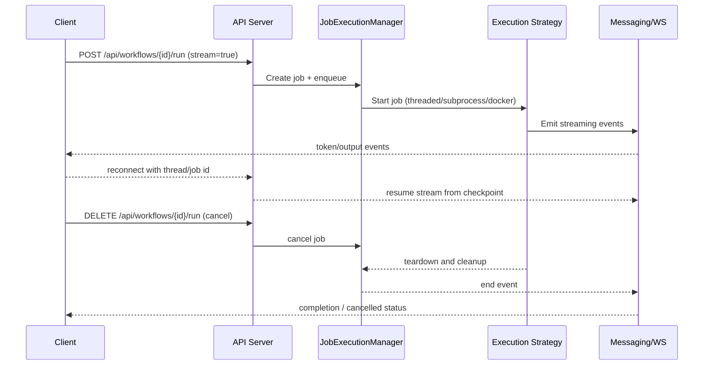

[← Back to Docs Index](index.md)

# Architecture & Lifecycle

**Audience:** Architects and operators.  
**What you will learn:** How NodeTool components fit together and how a job moves through the system.

## Component Diagram

```mermaid
flowchart LR
    Client[Clients / CLI / UI] -->|HTTP / WS / SSE| APIServer
    APIServer --> ChatServer
    APIServer --> WorkflowAPI
    ChatServer --> Messaging
    WorkflowAPI --> JobExecutionManager
    JobExecutionManager --> ThreadedRunner[Threaded Execution]
    JobExecutionManager --> SubprocessRunner[Subprocess Execution]
    JobExecutionManager --> DockerRunner[Docker Execution]
    JobExecutionManager --> Storage[(Storage / Assets)]
    JobExecutionManager --> Providers
    Providers -->|LLM / GenAI calls| ExternalServices[Providers (OpenAI, Anthropic, Gemini, Ollama, ComfyUI, etc.)]
    APIServer --> Proxy[Proxy (optional)]
    Proxy -->|TLS / Routing| APIServer
```

## Job Lifecycle (run, stream, reconnect, cancel)



## Notes

- All endpoints and examples use `http://127.0.0.1:8000` by default; update host/port when deploying.
- Messaging emits both JSON and optional MessagePack; see [chat-server](chat-server.md) for protocol details.
- Execution strategies are detailed in [execution-strategies](execution-strategies.md).
