# NodeTool's Streaming Architecture for Real-Time AI Workflows

NodeTool's execution engine uses an **actor-based streaming architecture** that enables real-time AI workflows without blocking. This document explains how it works and why it matters for building responsive AI applications.

## The Problem with Traditional DAG Execution

Most workflow engines process nodes sequentially or in topological waves:

```
Traditional: Node A completes → Node B starts → Node C starts
Problem: Long-running nodes block everything downstream
```

For AI workloads—LLM streaming, image generation, audio processing—this creates unacceptable latency. Users wait for entire responses before seeing anything.

## NodeTool's Solution: Actor-Based Streaming

NodeTool treats **everything as a stream**. A scalar value is just a stream of length 1. This unification enables:

- **Token-by-token LLM streaming** through the graph
- **Progressive image generation** with intermediate results
- **Real-time audio processing** with minimal latency
- **Backpressure** to prevent memory exhaustion

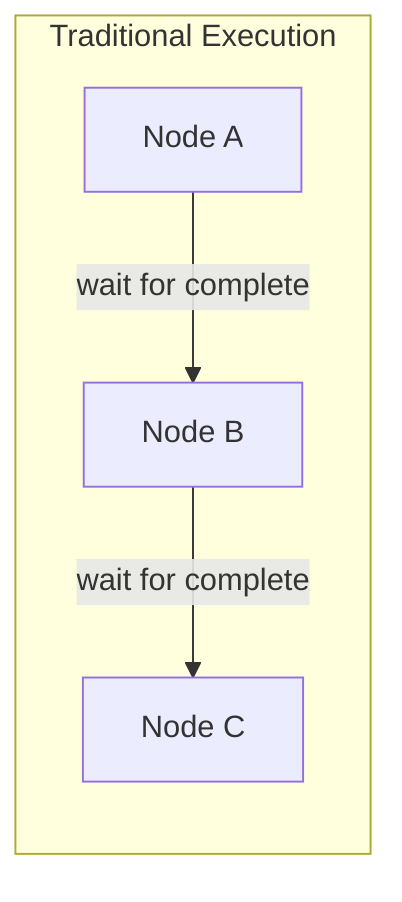

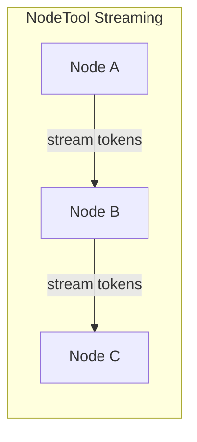

## Core Architecture

### One Actor Per Node

Each node runs in its own async task (`NodeActor`). No central scheduler blocks execution:

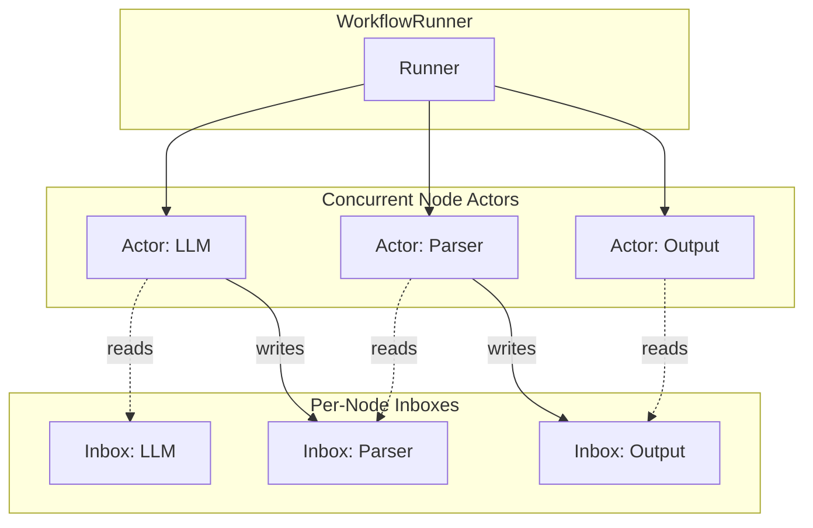

### NodeInbox: Per-Handle FIFO Buffers

Each node has an inbox with per-handle buffers. Producers write, consumers iterate:

```python
# Producer (upstream node via NodeOutputs)
await inbox.put("prompt", "Hello, world!")

# Consumer (node's run method via NodeInputs)
async for item in inputs.stream("prompt"):
    process(item)
```

Key features:
- **Per-handle FIFO ordering** preserves message sequence
- **Backpressure** via configurable buffer limits—producers block when buffers are full
- **EOS (End-of-Stream) tracking** per handle prevents hangs

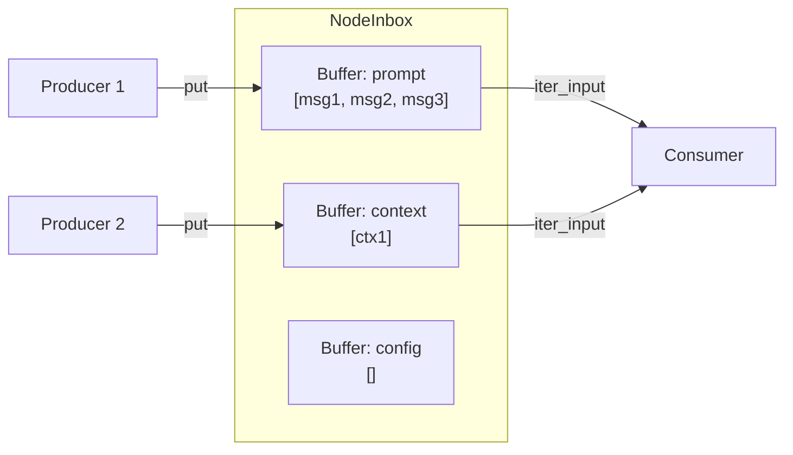

### Three Node Execution Modes

Nodes declare their streaming behavior via two flags:

| `is_streaming_input` | `is_streaming_output` | Behavior |
|---------------------|----------------------|----------|
| `False` | `False` | **Buffered**: Actor collects one value per input, calls `process()` once |
| `False` | `True` | **Streaming Producer**: Actor batches inputs, calls `gen_process()` per batch, which yields outputs |
| `True` | `True` | **Full Streaming**: Node controls inbox iteration via `iter_input()`/`iter_any()` |

```python
# Buffered node - process() called once with all inputs ready
class SumNode(BaseNode):
    async def process(self, context):
        return {"output": self.a + self.b}

# Streaming producer - yield tokens as they arrive
class LLMNode(BaseNode):
    @classmethod
    def is_streaming_output(cls) -> bool:
        return True
    
    async def gen_process(self, context):
        async for token in self.llm.stream(self.prompt):
            yield ("output", token)

# Full streaming - control input consumption
class StreamProcessor(BaseNode):
    @classmethod
    def is_streaming_input(cls) -> bool:
        return True
    
    @classmethod
    def is_streaming_output(cls) -> bool:
        return True
    
    async def run(self, context, inputs, outputs):
        async for handle, item in inputs.iter_any():
            result = transform(item)
            await outputs.emit("output", result)
```

## Data Flow Deep Dive

### Message Routing

When a node emits output, `WorkflowRunner.send_messages()` routes it to all connected downstream inboxes:

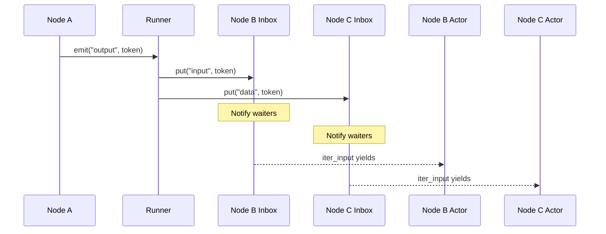

### Backpressure Mechanism

Configurable `buffer_limit` prevents memory exhaustion from fast producers:

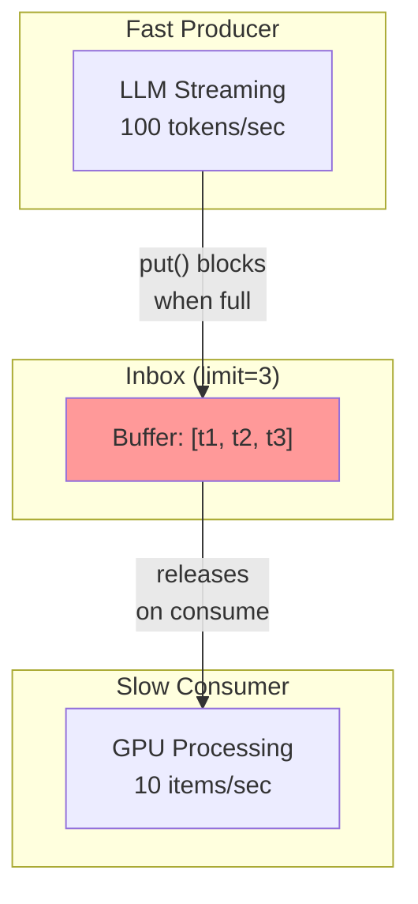

When a buffer is full:
1. Producer's `put()` awaits on a condition variable
2. Consumer pops an item, signals the condition
3. Producer resumes writing

### End-of-Stream (EOS) Handling

EOS tracking prevents downstream nodes from hanging:

```python
# Upstream counts tracked per handle
inbox.add_upstream("prompt", count=2)  # Two producers

# When each producer finishes
inbox.mark_source_done("prompt")  # Decrements count

# Consumer iteration terminates when count=0 and buffer empty
async for item in inbox.iter_input("prompt"):
    process(item)
# Exits cleanly when EOS is reached
```

## Input Synchronization Modes

Nodes control how multiple inputs are aligned via `sync_mode`:

### `on_any` (Default)

Fire on every arrival with latest values from other handles:

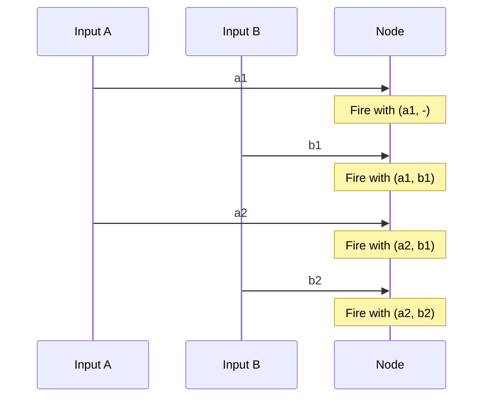

### `zip_all`

Wait for one item per handle, consume in lockstep:

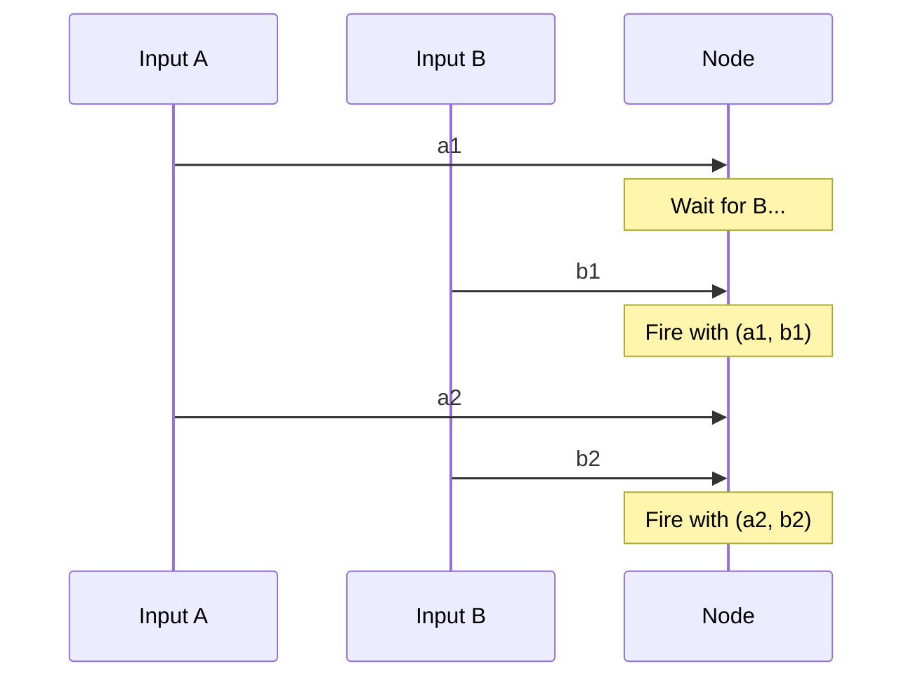

## GPU Coordination

A global async lock serializes GPU access across nodes:

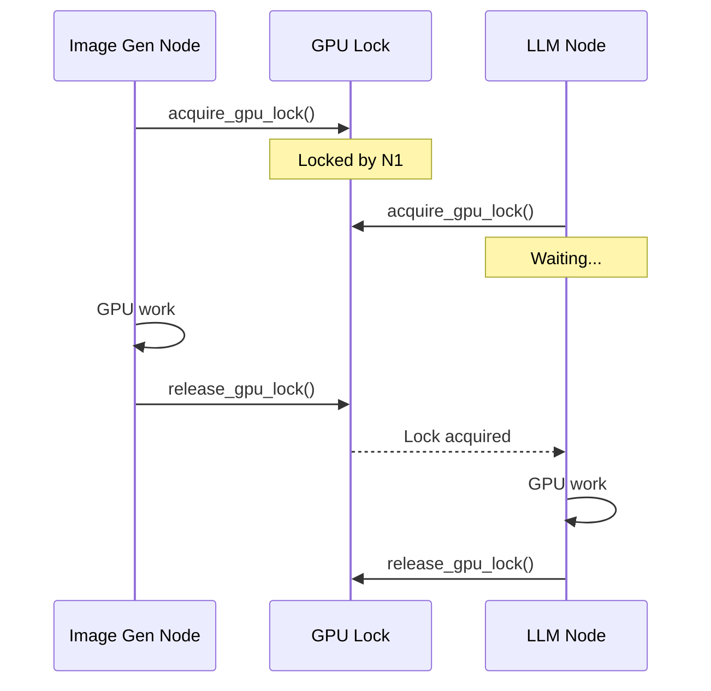

Features:
- **Non-blocking wait**: Uses `asyncio.Condition` so event loop stays responsive
- **Timeout protection**: 5-minute timeout with holder tracking for debugging
- **VRAM management**: Auto-frees memory before GPU operations

## Real-Time Client Updates

The architecture supports real-time UI updates via message posting:

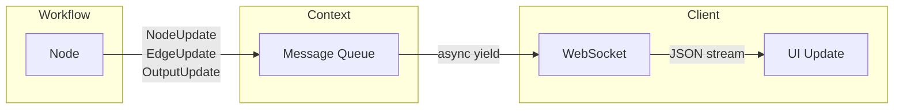

Update types:
- `NodeUpdate`: Status changes (running, completed, error)
- `EdgeUpdate`: Message counts, drained status
- `OutputUpdate`: Final values from output nodes
- `JobUpdate`: Workflow-level status

## Streaming Channels

For cross-node coordination beyond the graph topology, `ChannelManager` provides named pub/sub channels:

```python
# Publisher (any node)
await context.channels.publish("progress", {"step": 3, "total": 10})

# Subscriber (another node or external consumer)
async for msg in context.channels.subscribe("progress", "my-subscriber"):
    update_ui(msg)
```

Features:
- **Queue-per-subscriber** for isolation
- **Broadcast pattern** with backpressure
- **Type-safe channels** with runtime validation

## Benefits for AI Applications

### Token Streaming

LLM responses stream token-by-token through the graph:

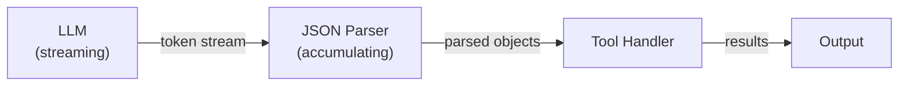

### Agentic Workflows

Long-running agents with tool use stay responsive:

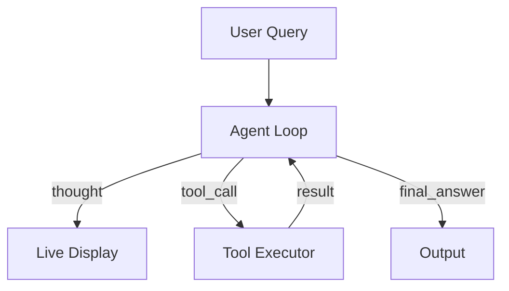

### Multi-Modal Pipelines

Images and audio process without blocking text:

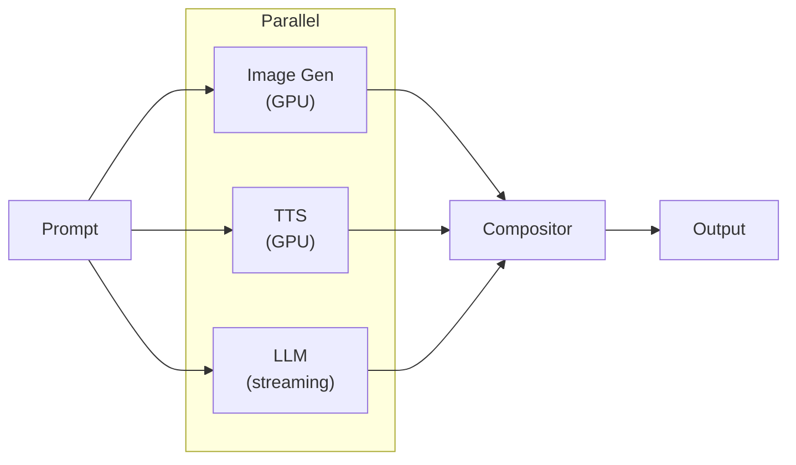

## Key Implementation Files

| File | Purpose |
|------|---------|
| `workflow_runner.py` | Orchestrates graph execution, manages inboxes, routes messages |
| `actor.py` | Per-node execution logic, streaming/buffered dispatch |
| `inbox.py` | Per-handle FIFO buffers with backpressure and EOS tracking |
| `io.py` | `NodeInputs`/`NodeOutputs` wrappers for node authors |
| `channel.py` | Named broadcast channels for dynamic coordination |
| `run_workflow.py` | High-level async interface with threaded execution option |

## Summary

NodeTool's streaming architecture delivers:

1. **Zero-latency token streaming** via per-node actors and FIFO inboxes
2. **Backpressure** to prevent memory exhaustion from fast producers
3. **GPU serialization** without blocking the event loop
4. **Real-time UI updates** through message posting
5. **Flexible input synchronization** via `sync_mode` options

The result: AI workflows that feel instant, even when processing takes time.
