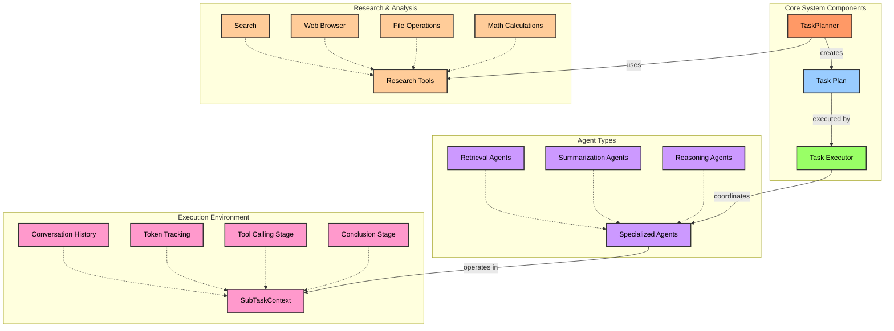

## Overview

The NodeTool Agent System provides:

- **Strategic Task Planning**: Break down complex objectives into structured, executable plans
- **Chain of Thought Reasoning**: Enable step-by-step problem solving with explicit reasoning
- **Multi-Agent Coordination**: Orchestrate specialized agents with different capabilities
- **Sophisticated Tool Integration**: Provide agents with capabilities like web browsing, file operations, and more
- **Context Management**: Efficiently handle context limitations through automatic summarization
- **Streaming Results**: Get live updates during the reasoning and execution process

## Architecture

The system is composed of three primary components:

1. **Agents**: Specialized problem-solvers with specific capabilities and objectives
2. **Task Planner**: Creates structured, dependency-aware execution plans
3. **Task Execution System**: Executes plans while managing resources and tracking progress



## Key Components

### Agent Base Class

The `Agent` class is the foundation for specialized agents with different capabilities:

- **Retrieval Agents**: Focus on gathering information from external sources
- **Summarization Agents**: Synthesize and condense information efficiently
- **Reasoning Agents**: Apply logical thinking to solve analytical problems

Each agent is configured with:

- A specific objective and description
- LLM provider and model
- Available tools
- System prompt tailored to its role
- Workspace for storing results

### Task Planner

The `TaskPlanner` strategically decomposes complex objectives into manageable tasks:

- Conducts initial research to inform planning
- Creates a directed acyclic graph (DAG) of tasks with dependencies
- Optimizes for parallel execution where possible
- Assigns tasks to appropriate specialized agents
- Saves plans for later execution or review

Planning follows a structured approach:

1. **Research Phase**: Gather relevant information to inform the plan
2. **Decomposition**: Break down the objective into sub-goals
3. **Task Creation**: Design specific tasks for each agent type
4. **Dependency Mapping**: Establish relationships between tasks

### SubTaskContext

The `SubTaskContext` provides an isolated execution environment for each subtask:

- Manages conversation history and token tracking
- Implements a two-stage execution model:
  - **Tool Calling Stage**: Multiple iterations of information gathering using any tools
  - **Conclusion Stage**: Final synthesis with restricted access (only finish_subtask tool)
- Handles automatic context summarization when token limits are exceeded
- Tracks progress and enforces execution constraints

## Usage Examples

### Creating a Basic Agent

```python
from nodetool.chat.agent import Agent
from nodetool.chat.providers.anthropic import AnthropicProvider

# Initialize a provider
provider = AnthropicProvider(api_key="your-api-key")

# Create a retrieval agent
retrieval_agent = Agent(
    name="Researcher",
    objective="Gather comprehensive information about quantum computing",
    description="Specialized in efficient information retrieval from the web",
    provider=provider,
    model="claude-3-opus-20240229",
    workspace_dir="./workspace",
    tools=[SearchTool(), BrowserTool()],
    system_prompt=RETRIEVAL_SYSTEM_PROMPT,
    max_steps=50
)
```

### Creating and Executing a Task Plan

```python
from nodetool.chat.task_planner import TaskPlanner
from nodetool.metadata.types import TaskPlan

# Create specialized agents
retrieval_agent = Agent(...)
summary_agent = Agent(...)

# Initialize the task planner
planner = TaskPlanner(
    provider=provider,
    model="claude-3-opus-20240229",
    objective="Research and summarize recent advances in quantum computing",
    workspace_dir="./workspace",
    tools=[SearchTool(), BrowserTool()],
    agents=[retrieval_agent, summary_agent],
    max_research_iterations=3
)

# Create the plan
async for chunk in planner.create_plan():
    print(chunk.content)

# Get the task plan
task_plan = planner.task_plan

# Execute a task for a specific agent
async for item in retrieval_agent.execute_task(task_plan, task_plan.tasks[0]):
    if isinstance(item, Chunk):
        print(item.content)
```

### Creating a Multi-Agent System

```python
# Create specialized agents
retrieval_agent = Agent(
    name="Researcher",
    objective="Gather information",
    # ... other parameters ...
)

summary_agent = Agent(
    name="Summarizer",
    objective="Create concise summaries",
    # ... other parameters ...
)

# Initialize task planner
planner = TaskPlanner(
    provider=provider,
    model="claude-3-opus-20240229",
    objective="Research and summarize quantum computing advances",
    workspace_dir="./workspace",
    tools=[SearchTool(), BrowserTool()],
    agents=[retrieval_agent, summary_agent]
)

# Create and execute the plan
async for chunk in planner.create_plan():
    print(chunk.content)

# Execute tasks for each agent
task_plan = planner.task_plan
for task in task_plan.tasks:
    if task.agent_name == "Researcher":
        async for item in retrieval_agent.execute_task(task_plan, task):
            print(item.content)
    elif task.agent_name == "Summarizer":
        async for item in summary_agent.execute_task(task_plan, task):
            print(item.content)
```

## System Prompts

The system includes specialized prompts for different agent types:

- **RETRIEVAL_SYSTEM_PROMPT**: Optimized for information gathering with emphasis on supplementary file downloads and focused search
- **SUMMARIZATION_SYSTEM_PROMPT**: Designed for efficient synthesis of information with proper citations
- **DETAILED_COT_SYSTEM_PROMPT**: Enables structured chain-of-thought reasoning for complex analytical tasks
- **DEFAULT_PLANNING_SYSTEM_PROMPT**: Guides the creation of optimal task plans with dependency management

## Advanced Features

### Context Management

The system automatically manages token limits through:

- Token counting and tracking for conversation history
- Automatic summarization when limits are approached
- Preserving critical information during summarization

### Tool Integration

Agents can use various tools:

- Web browsing and search tools
- File operations (read/write)
- Mathematical calculations
- Custom domain-specific tools

### Two-Stage Execution Model

Complex tasks are executed in two phases:

1. **Tool Calling Stage**: Information gathering using any available tools
2. **Conclusion Stage**: Final synthesis with restricted tools (only finish_subtask)

This ensures agents properly conclude their reasoning and produce final outputs.

## Integration with NodeTool Core

The Agent System is designed to work seamlessly with the broader NodeTool ecosystem:

- Nodes can utilize agents for specific workflow steps
- Results from agent tasks can feed into NodeTool workflows
- Agents can leverage NodeTool's existing provider integrations (OpenAI, Anthropic, Ollama)

## Limitations and Considerations

- **Token Limits**: LLMs have context window limitations that may require summarization during complex tasks
- **Tool Constraints**: Each tool has specific capabilities and limitations
- **Model Capabilities**: Different LLMs have varying reasoning abilities and should be selected appropriately
- **Task Complexity**: Very complex objectives may need careful decomposition into subtasks

## Advanced Examples

For more detailed examples, see the examples directory:

1. **Retrieval Agent**: Demonstrates simple information gathering
2. **Task Planning and Execution**: Shows separation of planning and execution phases
3. **Multi-Agent Coordination**: Illustrates how multiple specialized agents work together

## Next Steps

After understanding the basics:

1. Create custom agents for your specific use cases
2. Develop new tools to expand agent capabilities
3. Build multi-agent systems with specialized roles
4. Integrate these capabilities into your NodeTool workflows

For more information, refer to the main NodeTool documentation.
